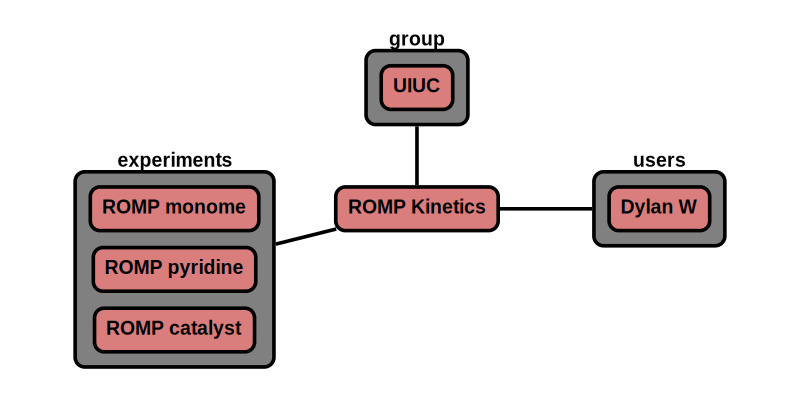

# Collections

The 'collection' node also for the grouping of experiments.

**Features:**

* collections within collections are allowed
* collection can reference users, groups, experiments, collections
* required information
    * name
    * experiments (CRIPT node)
* optional information
    * notes
    * user (CRIPT node)
    * group (CRIPT node)
    * collection (CRIPT node)
* auto generate/update:
    * _id
    * type
    * ver_sch
    * ver_con (& all child) <-- update with version control node
    * date (& all child)
    * users (& all child) <-- update with user node
    * num_expt <-- auto calculate
    * expt (& all child) <-- update with expt node
    * users (& all child) <-- update with user node
    * group (& all child) <-- update with group node

**App features to support this node:**

* a page to fill out collection details
* a tool to look up experiments, or enter _id
* a similar look up tool for users, and groups
* allow additional optional information in attribute section given that it begins with +

## JSON Schema

```json
{
  "_id": objectId(),
  "type": "coll",
  "ver_sch": string,
  "ver_con": {
    "_id": objectId(),
    "num": string
  },
  "date": [
    {"created": datetime},
    {"last_mod": datetime}
  ],
  "notes": string,
  "users": [
    {"_id": objectId(), "name": string, "perm": string}
  ],
  "name": string,
  "num_expt": int,
  "expt": [
    {"_id": objectId(), "name": string, "product": string}
  ],
  "attr": {
    "see attributes": "for details"
  }
}
```

---

## Description

Key                   |Data Type     |Required  |Description
-------------         |---------     |------    |----
`_id`                 |<span style="color:rgb(0, 72, 189)"> objectId() </span>|<span style="color:rgb(0, 72, 189)">  auto  </span>|<span style="color:rgb(0, 72, 189)">  unique database id  </span>
`type`                |<span style="color:rgb(0, 72, 189)">  string  </span> |<span style="color:rgb(0, 72, 189)">  auto  </span>|<span style="color:rgb(0, 72, 189)">  type of node ; Ex: "group"  </span>
`ver_sch`             |<span style="color:rgb(0, 72, 189)">  string  </span>|<span style="color:rgb(0, 72, 189)">  auto  </span>|<span style="color:rgb(0, 72, 189)">  schema version; Ex: "v0.1"  </span>
`ver_con`             |              |          |<span style="color:rgb(0, 72, 189)">  version control object  </span>
`ver_con/_id`         |<span style="color:rgb(0, 72, 189)">  objectId()  </span>|<span style="color:rgb(0, 72, 189)">  auto  </span>|<span style="color:rgb(0, 72, 189)">  reference id to node history  </span>
`ver_con/num`         |<span style="color:rgb(0, 72, 189)">  string  </span>|<span style="color:rgb(0, 72, 189)">auto  </span>|<span style="color:rgb(0, 72, 189)">  type of node ; Ex: "group"  </span>
`date`                |              |          |<span style="color:rgb(0, 72, 189)">  datetime object  </span>
`date/created`        |<span style="color:rgb(0, 72, 189)">  datetime  </span>|<span style="color:rgb(0, 72, 189)">auto  </span>|<span style="color:rgb(0, 72, 189)">  datetime created  </span>
`type/last_mod`       |<span style="color:rgb(0, 72, 189)">  datetime  </span>|<span style="color:rgb(0, 72, 189)">auto  </span>|<span style="color:rgb(0, 72, 189)">  last modified datetime  </span>
`notes`               |<span style="color:rgb(0, 72, 189)">  string  </span>|<span style="color:rgb(0, 72, 189)">auto  </span> |<span style="color:rgb(0, 72, 189)">  free-form space to store any text  </span>
`users`               |              |      |<span style="color:rgb(12, 145, 3)">  user permissions  </span>
`users/_id`           |<span style="color:rgb(12, 145, 3)">  objectId()   </span>|<span style="color:rgb(12, 145, 3)">  auto   </span>|<span style="color:rgb(12, 145, 3)">  user id  </span>
`users/name`          |<span style="color:rgb(12, 145, 3)">  string  </span>|<span style="color:rgb(12, 145, 3)">  auto   </span>|<span style="color:rgb(12, 145, 3)">  user name  </span>
`users/perm`          |<span style="color:rgb(12, 145, 3)">  string  </span>|<span style="color:rgb(12, 145, 3)">  auto   </span>|<span style="color:rgb(12, 145, 3)">  permission level; [r: read, w: write, a: append]  </span>
`name`                |string       | required  | name of collection
`num_expt`            | int         | auto      | number of experiments in collection
`expt`               |             |           | [experiment nodes](../data-models/Experiments.md)
`expt/_id`           | objectId()  | auto      | id for experiment
`expt/name`          | string      | auto      | name for experiment
`expt/prod`          | string      | auto      | main product of experiment
`attr`                | list        | auto      | see attributes section

### Attributes

Attributes are optional properties that can be associated with this node. The following list is the officially supported
keys. Users may define their own keys by placing a '+' in front of their custom key.

Key                   | Data Type       | Description
-------------         |---------       | ----
`users`               |                | [user details of authors if on platform](../data-models/Users.md)
`users\_id`           | objectId()     | author id
`users\name`          | string         | author name
`group`               |                | [groups that the user belongs to](../data-models/Groups.md)
`group\_id`           | objectId()     | id of group
`group\name`          | string         | name of group
`coll`                |                | [collection nodes](../data-models/Collections.md)
`coll\_id`            | objectId()     | id of collection
`coll\name`           | string         | name of collection
`coll\date`           | datetime       | date of collection
`coll\date\num_expt`  | double         | number of experiments in collection

---

## Example

```json
{
  "_id": "507f191e810c19729de861ec",
  "type": "coll",
  "ver_sch": "v0.1",
  "ver_con": {
    "_id": "507f191e810c19729de861cb",
    "num": "v2.1"
  },
  "date": [
    {"created": 1612881183},
    {"last_mod": 1612881123}
  ],
  "notes": "",
  "users": [
    {"_id": "507f191e810c19729de860ec", "name": "Dylan W", "perm": "w"}
  ],
  "name": "ROMP Kinetics",
  "num_expt": 3,
  "expt": [
    {"_id": "507f191e810c19729de860em", "name": "ROMP monomer order kinetic study", "date": 1612886423},
    {"_id": "507f191e810c19729de860en", "name": "ROMP pyridine order kinetic study", "date": 1612886423},
    {"_id": "507f191e810c19729de860ej", "name": "ROMP catalyst kinetic study", "date": 1612886423}
  ],
  "attr": {
    "users": [
      {"_id": "507f191e810c19729de860ec", "name": "Dylan W"}
    ],
    "group": [
      {"_id": "507f191e810c19729de860em", "name": "UIUC"}
    ]
  }
}
```

### Visualization



