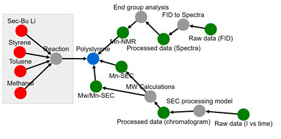
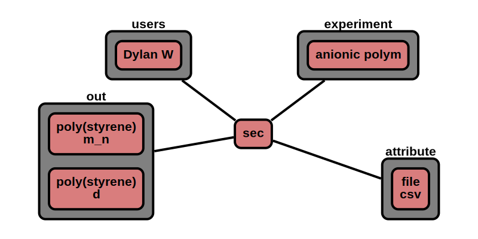

# Data

The 'data' node contains data related to raw or processed data. This can be an NMR fid, SEC trace, 
molecular weight distribution, or stress-strain curve.

**Features:**

* process and data nodes point to data nodes - optional (only one process nodes are allowed per chain, only one data 
  node allowed)
* data nodes points to material or data nodes (multiple material or data nodes are allowed, but not both material and
  data at the same time)
* required information
    * name
    * source
    * expt, mat (will be populated as it's linked to other nodes)
* optional information
    * type
    * history
    * file
    * file type
    * instrument details
    * calibration
    * column headers
    * row headers
    * data
* auto generate/update:
    * id_
    * type
    * ver_sch
    * ver_con (& all child) <-- update with version control node
    * date (& all child)
    * users (& all child) <-- update with user node
    * expt (& all child)  <-- update with expt node
    * mat (& all child) <-- update with material nodes


**App features to support this node:**

* a page to fill out: experiment(materials, process, data) data
* a page to plot, analyze data (csv or `data`)
* allow additional optional information in attribute section given that it begins with +
* units are not stored and all official values are converted to database standard prior to storage


## JSON Schema

```json
{
  "id_": objectId(),
  "type": "data",
  "ver_sch": string,
  "ver_con": {
    "id_": objectId(),
    "num": string
  },
  "date": [
    {"created": datetime},
    {"last_mod": datetime}
  ],
  "notes": string,
  "users": [
    {"id_": objectId(), "name": string, "perm": string}
  ],
  "name": string,
  "source": string,
  "expt": [
    {"id_": objectId(), "name": string, "date":  datetime}
  ],
  "mat": [
    {"id_": objectId(), "name": string, "prop": string, "value": double}
  ],
  "attr": {
    "see attributes": "for details"
  }
}
```

---

## Description

Key             |Data Type     |Required  |Description
-------------   |---------     |------    |----
`id_`          |<span style="color:rgb(0, 72, 189)"> objectId() </span>|<span style="color:rgb(0, 72, 189)">  auto  </span>|<span style="color:rgb(0, 72, 189)">  unique database id  </span>
`type`          |<span style="color:rgb(0, 72, 189)">  string  </span> |<span style="color:rgb(0, 72, 189)">  auto  </span>|<span style="color:rgb(0, 72, 189)">  type of node ; Ex: "group"  </span>
`ver_sch`       |<span style="color:rgb(0, 72, 189)">  string  </span>|<span style="color:rgb(0, 72, 189)">  auto  </span>|<span style="color:rgb(0, 72, 189)">  schema version; Ex: "v0.1"  </span>
`ver_con`       |              |          |<span style="color:rgb(0, 72, 189)">  version control object  </span>
`ver_con/id_`   |<span style="color:rgb(0, 72, 189)">  objectId()  </span>|<span style="color:rgb(0, 72, 189)">  auto  </span>|<span style="color:rgb(0, 72, 189)">  reference id to node history  </span>
`ver_con/num`   |<span style="color:rgb(0, 72, 189)">  string  </span>|<span style="color:rgb(0, 72, 189)">auto  </span>|<span style="color:rgb(0, 72, 189)">  type of node ; Ex: "group"  </span>
`date`          |              |          |<span style="color:rgb(0, 72, 189)">  datetime object  </span>
`date/created`  |<span style="color:rgb(0, 72, 189)">  datetime  </span>|<span style="color:rgb(0, 72, 189)">auto  </span>|<span style="color:rgb(0, 72, 189)">  datetime created  </span>
`type/last_mod` |<span style="color:rgb(0, 72, 189)">  datetime  </span>|<span style="color:rgb(0, 72, 189)">auto  </span>|<span style="color:rgb(0, 72, 189)">  last modified datetime  </span>
`notes`         |<span style="color:rgb(0, 72, 189)">  string  </span>|<span style="color:rgb(0, 72, 189)">auto  </span> |<span style="color:rgb(0, 72, 189)">  free-form space to store any text  </span>
`users`               |     |      |<span style="color:rgb(12, 145, 3)">  user permissions </span>
`users/id_`           |<span style="color:rgb(12, 145, 3)">  objectId()   </span>|<span style="color:rgb(12, 145, 3)">  auto   </span>|<span style="color:rgb(12, 145, 3)">  user id  </span>
`users/name`          |<span style="color:rgb(12, 145, 3)">  string  </span>|<span style="color:rgb(12, 145, 3)">  auto   </span>|<span style="color:rgb(12, 145, 3)">  user name  </span>
`users/perm`          |<span style="color:rgb(12, 145, 3)">  string  </span>|<span style="color:rgb(12, 145, 3)">  auto   </span>|<span style="color:rgb(12, 145, 3)">  permission level; [r: read, w: write, a: append]  </span>
`name`                | string         | required  | user name for data
`source`              | string         | required  | source of data [expt, proc, comp] experiment, processed data, computed data
`expt`                |                |           | [experiment nodes](../data-models/Experiments.md)
`expt\id_`            | objectId()     | auto      | id of experiments
`expt\name`           | string         | auto      | name of experiments
`expt\date`           | datetime       | auto      | date of experiments
`mat`                 |                |           | [material nodes](../Materials_P/#properties)
`mat\id_`             | objectId()     | auto      | id of material
`mat\name`            | string         | auto      | name of material
`mat\prop`            | string         | auto      | material property
`mat\value`           | double         | auto      | value of material property
`attr`                | list           | auto      | see attributes section


### Attributes

Attributes are optional properties that can be associated with this node. The following list is the officially supported
keys. Users may define their own keys by placing a '+' in front of their custom key.

Data can either be linked through `file` or placed directly in the document with `data`. `data` is restricted to #### total data points.
total data points = row * col

Key                   | Data Type       | Description
-------------         | ---------       | ----------
`type`                | string          | official type of measurement (see below [type](../Data/#type))
`histroy`             | dict            | data history (feature under construction)
`file`                | objectId()      | link to raw file
`file_type`           | string          | file type (ex. csv, txt, xlsm)
`equip`               | string          | equipment or instrument details/configuration
`cal`                 | string          | calibration details
`col_head`            | list            | labels for columns (order should match data)
`row_head`            | list            | labels for rows (order should match data)
`x_data`              | list            | raw data
`y_data`              | list            | raw data


### type

`type`         | x-axis            | x-axis unit   | y-axis           | y-axis unit | Description
------         |-------            | ---------     | -------          |---------    | --------
rxn_conv       | time              | min           | conversion       |             | reaction conversion vs time
mn_conv        | conversion        |               | m_n              | g/mol       | M_n vs monomer conversion
mwd            | molecular weight  | g/mol         | population       | mol frac    | molecular weight distribution (by mole)
mwd_wt         | molecular weight  | g/mol         | population       | wt frac     | molecular weight distribution (by weight)
sec_trace      | retention time    | min           | signal           |             | SEC trace (by retention time)
sec_trace_vol  | elution vol.      | ml            | signal           |             | SEC trace (by elution volume)
nmr            | time              | us            | voltage          | V           | Free induction decay
nmr_h1         | chemical shift    | ppm           | signal           |             | proton NMR (H1 NMR)
nmr_c13        | chemical shift    | ppm           | signal           |             | carbon NMR (C13 NMR)
nmr_n15        | chemical shift    | ppm           | signal           |             | nitrogen NMR (N15 NMR)
nmr_o17        | chemical shift    | ppm           | signal           |             | oxygen NMR (O17 NMR)
nmr_f19        | chemical shift    | ppm           | signal           |             | fluorine NMR (F19 NMR)
nmr_si29       | chemical shift    | ppm           | signal           |             | silicon NMR (Si29 NMR)
nmr_p31        | chemical shift    | ppm           | signal           |             | phosphorous NMR (P31 NMR)
nmr_noe        | chemical shift    | ppm           | signal           |             | nuclear Overhauser effect NMR
nmr_tocsy      | chemical shift    | ppm           | signal           |             | total correlation spectroscopy NMR
ir             | wavenumber        | cm**-1        | signal           |             | infrared spectroscopy
stess_st       | stess             | kPa           | strain           |             | stress strain curve
waxs           | q                 | angstrom**-1  | intensity        |             | wide angle light scattering
saxs           | q                 | angstrom**-1  | intensity        |             | small angle light scattering
g_prime        | frequency         | rad/s         | stress           | Pa          | storage modulus
g_doub_prime   | frequency         | rad/s         | stress           | Pa          | loss modulus
**2d data**    |
nmr_cosy       | chemical shift    | ppm           | chemical shift   | ppm         | correlation spectroscopy NMR (H - H)
nmr_hsqc       | chemical shift    | ppm           | chemical shift   | ppm         | heteronuclear single-quantum correlation spectroscopy NMR (H - C)
nmr_hmbc       | chemical shift    | ppm           | chemical shift   | ppm         | heteronuclear multiple-bond correlation spectroscopy NMR (H - C)
nmr_dosy       | chemical shift    | ppm           | diffusion coeff. | m**2/s      | Diffusion NMR 
waxs_i         | distance          | nm**-1        | distance         | nm**-1      | wide angle light scattering image
saxs_i         | distance          | nm**-1        | distance         | nm**-1      | small angle light scattering image


## Data history
**Under construction**



---

## Example

```json
{
  "id_": "507f191e810c19729de860ec",
  "type": "data",
  "ver_sch": "v0.1",
  "ver_con": {
    "id_": "507f191e810c19729de860cb",
    "num": "v0.1"
  },
  "date": [
    {"created": 1612889183},
    {"last_mod": 1612889123}
  ],
  "notes": "",
  "users": [
    {"id_": "507f191e810c19729de860ec", "name": "Dylan W", "perm": "w"}
  ],
  "name": "sec",
  "source": "expt",
  "expt": [
    {"id_": "507f191e810c19729de860em", "name": "Anionic polymerization", "date": 1612886423}
  ],
  "mat": [
    {"id_": "507f191e810c19729de860ed", "name": "poly(styrene)", "prop": "m_n", "value": 5300},
    {"id_": "507f191e810c19729de860ed", "name": "poly(styrene)", "prop": "d", "value": 1.03}
  ],
  "attr": {
    "file": "507f191e810c19729de860ed",
    "file_type": "csv"
  }
}
```

### Visualization


