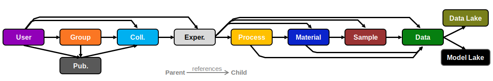

# Data Schema Explained

The data schema consists of 4 main nodes:

* **Material:** contains identity and property data for a chemical
* **Process:** contains ingredient list, quantities, and procedure information
* **Sample:** contains procedure and property information
* **Data:** contains raw or processed data

These 4 nodes contain all the relevant polymer information. The fifth node 'models' contains functions which 
transform raw data to processed data or properties.  

## Data Model Explained

The data model provides a specific implementation of the data schema, and additional features. In particular, it adds several
organizational nodes:

* **User:** contains information about an individual using the database
* **Group:** contains information about group and ownership of collections and experiments lies with groups
* **Collection:** are groups of experiments or other collections
* **Publication:** contains collections which embodies a literature publication
* **Experiment:** are a set of Process, Material, Sample, Data nodes

It also adds to locations to handle data and models:

* **Data Lake:** location of all raw data files
* **Model Lake:** collection of data transformation and analysis tools

A new user joining the CRIPT ecosystem will result in the creation of a new user node. The user can then either create 
a new group or join an existing group. If a new group is formed then a new collection will be made in which the first 
experiment can be placed into. If a user is joining an existing group, the user will have access to all collections and 
embedded experiments the group has ownership of. Collections can be turned into publications which removes all write 
capabilities for any embedded document.

