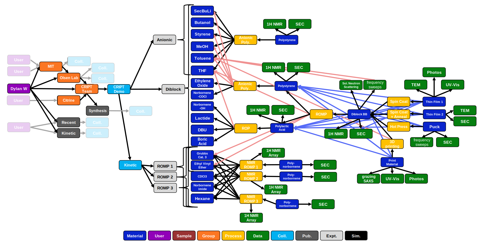
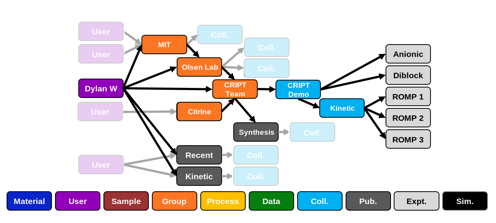
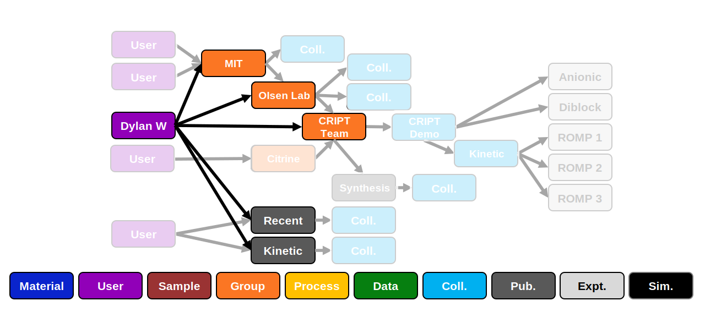
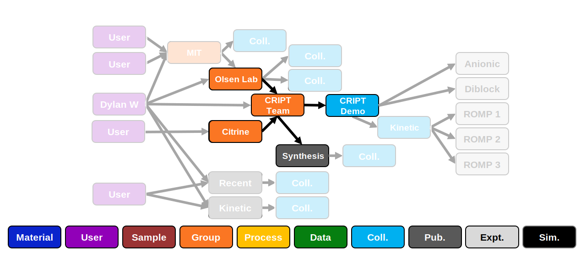
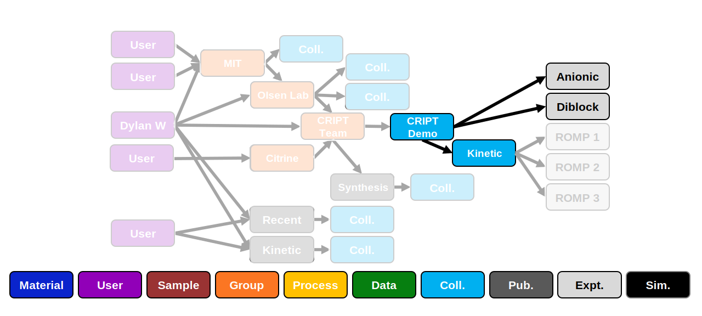
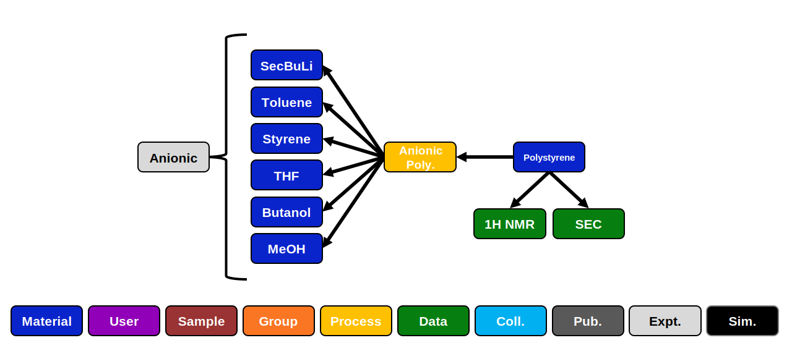
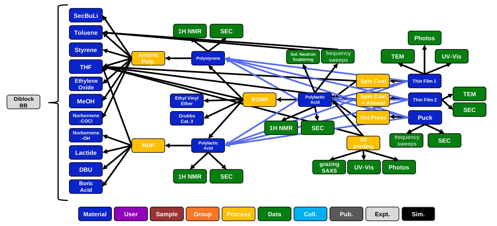
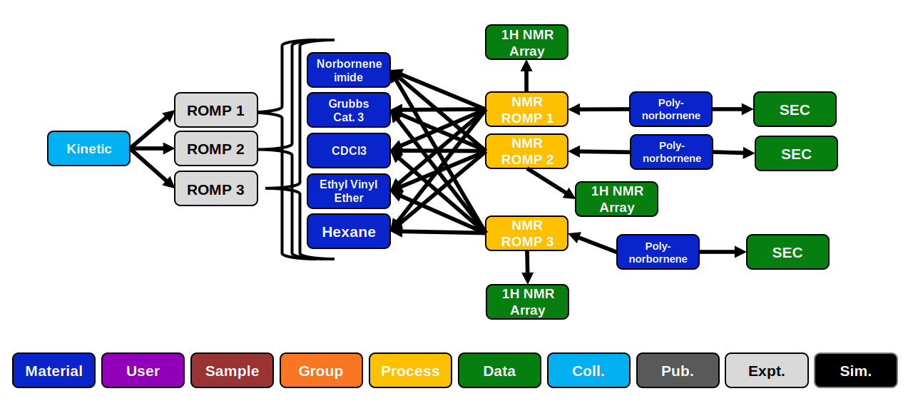

# Example
To show how the data schema can be implemented, we will go through an example. We start by creating a user, group, and collection. 
Then we will create several real-world experiments.




## User, Group, Collection

For a new user, the first step that needs to be done is to create a 'user'. Once the 'user' is created, then
the user can either join an existing 'group' or create a new 'group'. Typically, 'groups' are created and own by a supervisor
since 'groups' maintain ownership over 'collections'/'experiments' (such as a principal investigator for an academic lab). 
In this example, we will create a new 'group' named: "CRIPT Team". With a 'user' now in a 'group', we can create a 'collection' that 
will hold the experiments. 





### User
[User node](../data-models/Users.md)

```json
{
  "_id": "607f1720633b3e6e70e529c7",
  "class": "user",
  "ver_sch": "v0.1",
  "ver_con": {
    "_id": "507f191e810c19729de860cb",
    "num": "v0.1"
  },
  "last_modified": "2021-04-20 18:07:57",
  "created": "2021-04-20 18:02:08",
  "name": "Dylan W",
  "email": "dylan@cript.edu",
  "owns_groups": [{"_id": "607f180c633b3e6e70e529c8", "name": "CRIPT Team"}],
  "in_groups": [
    {"_id": "607f180c633b3e6e70e529c8", "name": "MIT"},
    {"_id": "607f180c633b3e6e70e529c7", "name": "Olsen Lab"}
  ],
  "publication": [
    {"_id": "507f191e810c19729de860eq", "name": "Recent trends in catalytic polymerizations"},
    {"_id": "507f191e810c19729de860er", "name": "Kinetic study of living ring-opening metathesis polymerization with third-generation Grubbs catalysts"}
  ],
  "orcid": "0000-0000-0000-0001",
  "organization": "Mass. Institute of Technology",
  "position": "Research Assistant"
}
```



### Group
[Group node](../data-models/Group.md)

```json
{
  "_id": "607f180c633b3e6e70e529c8",
  "class": "group",
  "version_schema": "v0.1",
  "version_control": {
    "_id": "507f191e810c19729de860eb",
    "num": "v0.1"
  },
  "last_modified": "2021-04-20 18:27:50",
  "created": "2021-04-20 18:06:04",
  "name": "CRIPT Team",
  "collection": [
      {"_id": "507f191e810c19729de860em", "name": "CRIPT Demo", "created": "2021-04-20 18:06:04"}
    ],
  "parent_group": [
      {"_id": "507f191e810c19729de860em", "name": "Olsen Lab"},
      {"_id": "507f191e810c19729de860en", "name": "Citrine"}
    ],
  "publication": [
      {"_id": "507f191e810c19729de860em", "title": "Synthesis of new polymer"}
    ],
  "website": "https://cript.mit.edu/",
  "email": "cript@mit.edu"
}
```



### Collection

[Collection node](../data-models/Collections.md)

```json
{
  "_id": "607f180c633b3e6e70e529c8",
  "class": "coll",
  "version_schema": "v0.1",
  "version_control": {
    "_id": "507f191e810c19729de860eb",
    "num": "v0.1"
  },
  "last_modified": "2021-04-20 18:27:50",
  "created": "2021-04-20 18:06:04",
  "name": "CRIPT Demo",
  "number_experiments": 2, 
  "experiment": [
    {"_id": "507f191e810c19729de860em", "name": "Anionic polymerization of styrene", "created": "2021-04-20 18:06:04"},
    {"_id": "507f191e810c19729de860en", "name": "Diblock bottlebrush synthesis and assembly", "created": "2021-04-20 18:06:04"}
  ],
    "child_collection": [
    {"_id": "507f191e810c19729de860em", "name": "Kinetic analysis of ROMP", "created": "2021-04-20 18:06:04"}
  ]
}
```



---

---

## Experiments

When defining an experiment it is best to start with the ingredient material nodes, followed by process, data nodes. 
After that the final product material node can be defined, followed by the experiment node. 

### Experiment 1: Anionic polymerization of styrene

The following example is the anionic polymerization of styrene with secBuLi in a mixture of THF and Toluene. The reaction
is then quenched with butanol and precipitated into methanol to obtain the final product, polystyrene. 

Following the above suggestions, we can start by defining the ingredient material nodes. Both styrene and secbuli solution are 
written out below. These materials nodes contain information with regard to identity (name, SMILES string, CAS number), and properties
(molecular weight, boiling point, etc.). The second node to be defined will be a process node. The process node  
contains links to the ingredient material nodes as well as the quantities of each material used in the polymerization. 
The polymerization node also contains experimental procedure details and conditions under which the process was preformed 
under (reaction time, temperature). Next the data nodes can be defined, in which both a ^1^H NMR and SEC analysis was preformed
to get M~n~ and dispersity. Finally, we can define the product material node, polystyrene. Here we can include the same identity, 
property data. All these nodes then are referenced in an experimental node. 





#### Experiment node

[Experiment node](../data-models/Experiment.md)

```json
{
  "_id": "507f191e810c19729de860ec",
  "class": "expt",
  "version_schema": "v0.1",
  "version_control": {
    "_id": "507f191e810c19729de860eb",
    "num": "v0.1"
  },
  "last_modified": "2021-04-20 18:27:50",
  "created": "2021-04-20 18:06:04",
  "name": "Anionic polymerization of styrene",
  "nodes": {
    "materials": [
      {"_id": "507f191e810c19729de860ec", "name": "SecBuLi"},
      {"_id": "507f191e810c19729de860ed", "name": "toluene"},
      {"_id": "507f191e810c19729de860ee", "name": "styrene"},
      {"_id": "507f191e810c19729de860eg", "name": "THF"},
      {"_id": "507f191e810c19729de860eh", "name": "butanol"},
      {"_id": "507f191e810c19729de860ei", "name": "methanol"},
      {
        "_id": "507f191e810c19729de860ef", 
        "name": "polystyrene", 
        "id_proc": "507f191e810c19729de860pe", 
        "id_data":["507f191e810c19729de860md", "507f191e810c19729de860me"]
      }
    ],
    "process": [
      {
      "_id": "507f191e810c19729de860pe", 
      "name": "anionic polymerization", 
      "id_mat": [
        "507f191e810c19729de860ec",
        "507f191e810c19729de860ed",
        "507f191e810c19729de860ee",
        "507f191e810c19729de860eg",
        "507f191e810c19729de860eh",
        "507f191e810c19729de860ei"
      ]
    }
    ],
    "data": [
      {"_id": "507f191e810c19729de860md", "name": "1H NMR"},
      {"_id": "507f191e810c19729de860me", "name": "SEC"}
    ]
  },
  "reference": "10.1139/v60-254"
}
```


#### Material node

[Material node other](../data-models/Materials_O.md)

[Material node polymers](../data-models/Materials_P.md)

The following materials nodes:

* styrene
* secBuLi solution
* polystyrene


```json
{
  "_id": "507f191e810c19729de860ee",
  "class": "material_p",
  "version_schema": "v0.1",
  "version_control": {
    "_id": "607f191e810c19729de860eb",
    "num": "v0.1"
  },
  "last_modified": "2021-04-20 18:27:50",
  "created": "2021-04-20 18:06:04",
  "name": "styrene",
  "identifiers": [
    {
      "mat_id": 1,
      "pref_name": "styrene",
      "names": ["styrene","vinylbenzene", "phenylethylene", "ethenylbenzene"],
      "chem_form": "C8H8",
      "smiles": "C=Cc1ccccc1",
      "cas": "100-42-5",
      "pubChem_cid": "7501 ",
      "inchi_key": "PPBRXRYQALVLMV-UHFFFAOYSA-N"
    }
  ],
  "properties": [
    {"mat_id": 0, "key": "phase", "value": "liquid"},
    {"mat_id": 0, "key": "color", "value": "colorless"}, 
    {"mat_id": 0, "key": "mw", "method": "prescribed", "value": 104.15},
    {
      "mat_id": 0, 
      "key": "density", 
      "value": 0.906, 
      "conditions": [{"key": "temperature", "value": 25}]
    },
    {
      "mat_id": 0,
      "key": "bp", 
      "value": 145, 
      "conditions": [{"key": "pressure", "value": 101}]
    },
    {
      "mat_id": 0,
      "key": "mp", 
      "value": -30, 
      "conditions": [{"key": "pressure", "value": 101}]
    },
    {
      "mat_id": 0,
      "key": "solubility", 
      "value": 0.3, 
      "conditions": [
        {"key": "solvent", "_id": "607f191e810c19729de860ea", "name":  "water"},
        {"key": "temperature", "value": 20}
      ]
    },
    {
      "mat_id": 0,
      "key": "vapor_pres", 
      "value": 0.666, 
      "conditions": [{"key": "temperature", "value": 20}]
    }
  ],
  "keywords": ["styrene"],
  "source": "Sigma-Aldrich",
  "storage": {"temp": -20, "atm": "argon" }
}
```

```json
{
  "_id": "507f191e810c19729de860ec",
  "class": "material_p",
  "version_schema": "v0.1",
  "version_control": {
    "_id": "607f191e810c19729de860ew",
    "num": "v0.1"
  },
  "last_modified": "2021-04-20 18:27:50",
  "created": "2021-04-20 18:06:04",
  "name": "SecBuLi solution",
  "identifiers": [
    {
      "mat_id": 1,
      "pref_name": "sec-butyllithium",
      "names": ["sec-butyllithium", "lithium-2-butanide", "SecBuLi", "sBuLi"],
      "chem_form": "C4H9Li1",
      "smiles": "[Li]C(C)CC",
      "cas": "598-30-1",
      "pubChem_cid": "102446 "
    },
    {
      "mat_id": 2,
      "pref_name": "cyclohexane",
      "_id": "607f191e810c19729de860es"
    }
  ],
  "properties": [
    {"mat_id": 0, "key": "phase", "value": "liquid"},
    {"mat_id": 0, "key": "color", "value": "white"},
    {"mat_id": 1, "key": "mw", "method": "prescribed", "value": 64.06},
    {
      "mat_id": 0,
      "key": "density",
      "value": 0.769,
      "conditions": [{"key": "temperature", "value": 25}]
    },
    {"mat_id": 1, "key": "conc", "value": 1.4}
  ],
  "source": "Sigma-Aldrich",
  "storage": {"temp": 2, "atm": "argon"}
}
```

```json
{
  "_id": "507f191e810c19729de860ef",
  "class": "material_p",
  "version_schema": "v0.1",
  "version_control": {
    "_id": "607f191e810c19729de860et",
    "num": "v0.1"
  },
  "last_modified": "2021-04-20 18:27:50",
  "created": "2021-04-20 18:06:04",
  "name": "polystyrene",
  "identifiers": [
    {
      "mat_id": 1,
      "pref_name": "poly(styrene)",
      "names": ["poly(styrene)","poly(vinylbenzene)"],
      "chem_repeat": ["C8H8"],
      "bigsmiles": "[H]{[>][<]C(C[>])c1ccccc1[<]}C(C)CC",
      "cas": "100-42-5"
    }
  ],
  "process": {"_id": "507f191e810c19729de860pe", "name": "anionic polymerization"},
   "properties": [
     {
       "mat_id": 0,
       "key": "m_n",
       "method": "nmr",
       "value": 4800,
       "uncer": 400,
       "data_id": "507f191e810c19729de860em"
     },
     {
       "mat_id": 0,
       "key": "m_n",
       "method": "sec",
       "value": 5200,
       "uncer": 100,
       "data_id": "507f191e810c19729de860er"
     },
     {
       "mat_id": 0,
       "key": "d",
       "method": "sec",
       "value": 1.03,
       "uncer": 0.01,
       "data_id": "507f191e810c19729de860er"
     }
   ]
}
```


#### Process node

[Process node](../data-models/Process.md)

```json
{
  "_id": "507f191e810c19729de860pe",
  "class": "process",
  "version_schema": "v0.1",
  "version_control": {
    "_id": "607f191e810c19729de860et",
    "num": "v0.1"
  },
  "last_modified": "2021-04-20 18:27:50",
  "created": "2021-04-20 18:06:04",
  "name": "anionic polymerization",
  "ingredients": [
    { 
      "_id": "507f191e810c19729de860ec",
      "name": "SecBuLi",
      "type": "initiator",
      "quantities": [
        {"key": "volume", "value": 0.017},
        {"key": "mole", "value": 0.022},
        {"key": "equivalence", "value": 1}
      ]
    },
    { 
      "_id": "507f191e810c19729de860ed",
      "name": "toluene",
      "type": "solvent",
      "quantities": [
        {"key": "mass", "value": 8.7},
        {"key": "volume", "value": 10},
        {"key": "mole", "value": 94.4},
        {"key": "equivalence", "value": 4234}
      ]
    },
    { 
      "_id": "507f191e810c19729de860em",
      "name": "styrene",
      "type": "monomer",
      "quantities": [
        {"key": "mass", "value": 0.455},
        {"key": "volume", "value": 0.5},
        {"key": "mole", "value": 4.27},
        {"key": "equivalence", "value": 191.5}
      ]
    },
    { 
      "_id": "507f191e810c19729de860eg",
      "name": "THF",
      "type": "solvent",
      "quantities": [
        {"key": "mass", "value": 3.28},
        {"key": "volume", "value": 3.7},
        {"key": "mole", "value": 45.5},
        {"key": "equivalence", "value": 2042}
      ]
    },
    { 
      "_id": "507f191e810c19729de860eh",
      "name": "butanol",
      "type": "quench"
    },
    { 
      "_id": "507f191e810c19729de860em",
      "name": "methanol",
      "type": "workup"
    }
  ],
  "procedure": "In an argon filled glovebox, a round bottom flask was filled with 216 ml of dried toluene. The solution of secBuLi (3 ml, 3.9 mmol) was added next, followed by styrene (22.3 g, 176 mmol) to initiate the polymerization. The reaction mixture immediately turned orange. After 30 min, the reaction was quenched with the addition of 3 ml of methanol. The polymer was isolated by precipitation in methanol 3 times and dried under vacuum.",
  "conditions": [
    {"key": "time", "value": [60]},
    {"key": "temp", "value": [25]}
  ],
  "properties": [
    {
      "key": "yield_mass",
      "method": "scale",
      "value": 0.47,
      "uncer": 0.02
    }
  ],
  "keywords": ["polymerization", "living_poly", "anionic", "solution"]
}
```


#### Data node

[Data node](../data-models/Data.md)

```json
{
  "_id": "507f191e810c19729de860md",
  "class": "data",
  "version_schema": "v0.1",
  "version_control": {
    "_id": "607f191e810c19729de860et",
    "num": "v0.1"
  },
  "last_modified": "2021-04-20 18:27:50",
  "created": "2021-04-20 18:06:04",
  "name": "1H NMR",
  "type": "nmr_h1",
  "source": "expt",
  "file": {"_id": "507f191e810c19729de860ed","type": "csv"},
  "sample_preparation": "Dissolved 10 mg of polymer into 0.6 ml of CDCl3.",
  "conditions": [
    {"key": "solvent", "_id": "507f191e810c19729de860md", "name": "CDCl3"}
  ],
  "equipment": {"description": "Nuclear Magnetic Resonance (NMR) spectra were recorded on a Bruker AVANCE III 500 MHz."},
  "calibration": {"description": "Spectra referenced to the residual solvent signal: CDCl3 (1H 7.26 ppm)"}
}
```


---

### Experiment 2: Diblock bottlebrush synthesis and assembly



#### Material node

[Material node other](../data-models/Materials_O.md)

[Material node polymers](../data-models/Materials_P.md)

The following materials nodes:

* Polystyrene
* Diblock BB
* Thin Film 1

```json
{
  "_id": "507f191e810c19729de860ef",
  "class": "material_p",
  "version_schema": "v0.1",
  "version_control": {
    "_id": "607f191e810c19729de860et",
    "num": "v0.1"
  },
  "last_modified": "2021-04-20 18:27:50",
  "created": "2021-04-20 18:06:04",
  "name": "polystyrene",
  "identifiers": [
    {
      "mat_id": 1,
      "pref_name": "poly(styrene)",
      "names": ["poly(styrene)","poly(vinylbenzene)"],
      "chem_repeat": ["C8H8"],
      "bigsmiles": "CCC(C){[<][<]C(C[>])c1ccccc1[>]}CCOC(=O)C1CC2C=CC1C2",
      "cas": "100-42-5"
    }
  ],
  "process": {"_id": "507f191e810c19729de860pe", "name": "anionic polymerization"},
  "properties": [
     {
       "mat_id": 0,
       "key": "m_n",
       "method": "nmr",
       "value": 4800,
       "uncer": 400,
       "data_id": "507f191e810c19729de860em"
     },
     {
       "mat_id": 0,
       "key": "m_n",
       "method": "sec",
       "value": 5200,
       "uncer": 100,
       "data_id": "507f191e810c19729de860er"
     },
     {
       "mat_id": 0,
       "key": "d",
       "method": "sec",
       "value": 1.03,
       "uncer": 0.01,
       "data_id": "507f191e810c19729de860er"
     },
     {
       "mat_id": 1,
       "component": "{[$]CC(c1ccccc1)[$]}",
       "key": "m_n",
       "method": "nmr",
       "value": 4600,
       "uncer": 400,
       "data_id": "507f191e810c19729de860em"
     },
     {
       "mat_id": 1,
       "component": "{[$]CC(c1ccccc1)[$]}",
       "key": "m_n",
       "method": "sec",
       "value": 5000,
       "uncer": 100,
       "data_id": "507f191e810c19729de860er"
     },
     {
       "mat_id": 1,
       "component": "{[$]CC(c1ccccc1)[$]}",
       "key": "d",
       "method": "sec",
       "value": 1.03,
       "uncer": 0.01,
       "data_id": "507f191e810c19729de860er"
     }
   ]
}
```


```json
{
  "_id": "507f191e810c19729de860ez",
  "class": "material_p",
  "version_schema": "v0.1",
  "version_control": {
    "_id": "607f191e810c19729de860ss",
    "num": "v0.1"
  },
  "last_modified": "2021-04-20 18:27:50",
  "created": "2021-04-20 18:06:04",
  "name": "Diblock bottlebrush",
  "identifiers": [
    {
      "mat_id": 1,
      "pref_name": "Diblock bottlebrush of poly(styrene) and poly(lactic acid)",
      "names": ["diblock bottlebrush of poly(styrene) and poly(lactic acid)", "(PS-b-PLA) diblock bottlebrush"],
      "chem_repeat": ["C8H8","C3H4O2"],
      "bigsmiles": ""
    },
    {
      "mat_id": 2,
      "pref_name": "poly(styrene) bottlebrush",
      "names": ["poly(styrene)","poly(vinylbenzene)"],
      "chem_repeat": ["C8H8"],
      "bigsmiles": ""
    },
    {
      "mat_id": 3,
      "pref_name": "poly(styrene)",
      "_id": "507f191e810c19729de860ef"
    }
  ],
  "process": {"_id": "507f191e810c19729de860de", "name": "ROMP"},
  "properties": [
    {
      "mat_id": 0,
      "component": "{[$]CC(c1ccccc1)[$]}",
      "key": "molar_p",
      "method": "nmr",
      "value": 0.46,
      "uncer": 0.04,
      "conditions": [{"key": "relative", "name": "{[>]CC(O[>])C(=O)[<][<]}"}],
      "data_id": "507f191e810c19729de860td"
     },
    {
      "mat_id": 1,
      "key": "molar_p",
      "method": "sec",
      "value": 0.92,
      "uncer": 0.02,
      "conditions": [{"key": "relative", "mat_id": 2}, {"key": "relative", "mat_id": 3}],
      "data_id": "507f191e810c19729de860en"
     },
    {
      "mat_id": 2,
      "key": "molar_p",
      "method": "sec",
      "value": 0.05,
      "uncer": 0.02,
      "conditions": [{"key": "relative", "mat_id": 1}, {"key": "relative", "mat_id": 3}],
      "data_id": "507f191e810c19729de860en"
     },
     {
      "mat_id": 1,
      "key": "m_n",
      "method": "sec",
      "value": 603000,
      "uncer": 30000,
      "data_id": "507f191e810c19729de860en"
     },
    {
      "mat_id": 1,
      "key": "d",
      "method": "sec",
      "value": 1.03,
      "uncer": 0.01,
      "data_id": "507f191e810c19729de860en"
     },
     {
       "mat_id": 2,
      "key": "m_n",
      "method": "sec",
      "value": 290000,
      "uncer": 30000,
      "data_id": "507f191e810c19729de860en"
     },
     {
       "mat_id": 2,
      "key": "d",
      "method": "sec",
      "value": 1.05,
      "uncer": 0.01,
      "data_id": "507f191e810c19729de860en"
     },
     {
       "mat_id": 3,
      "key": "m_n",
      "method": "sec",
      "value": 4800,
      "uncer": 200,
      "data_id": "507f191e810c19729de860en"
     },
     {
       "mat_id": 3,
      "key": "d",
      "method": "sec",
      "value": 1.05,
      "uncer": 0.01,
      "data_id": "507f191e810c19729de860en"
     },
     {
      "mat_id": "507f191e810c19729de860ef;1",
      "component": "{[$]CC(c1ccccc1)[$]}",
      "key": "m_n",
      "method": "sec",
      "value": 4600,
      "uncer": 400
     },
     {
      "mat_id": "507f191e810c19729de860ef;1",
      "component": "{[$]CC(c1ccccc1)[$]}",
      "key": "m_n",
      "method": "sec",
      "value": 5000,
      "uncer": 100
     },
     {
      "mat_id": "507f191e810c19729de860ef;1",
      "component": "{[$]CC(c1ccccc1)[$]}",
      "key": "d",
      "method": "sec",
      "value": 1.03,
      "uncer": 0.01
     },
     {
      "mat_id": "507f191e810c19729de860eg;1",
      "component": "{[>]CC(O[>])C(=O)[<][<]}",
      "key": "m_n",
      "method": "sec",
      "value": 4700,
      "uncer": 400
     },
     {
      "mat_id": "507f191e810c19729de860eg;1",
      "component": "{[>]CC(O[>])C(=O)[<][<]}",
      "key": "m_n",
      "method": "sec",
      "value": 5200,
      "uncer": 100
     },
     {
      "mat_id": "507f191e810c19729de860eg;1",
      "component": "{[>]CC(O[>])C(=O)[<][<]}",
      "key": "d",
      "method": "sec",
      "value": 1.09,
      "uncer": 0.01
     }
   ],
  "data": [
    {"_id": "507f191e810c19729de860rr", "name": "solution neutron scattering", "type": ["s_neutron"]},
    {"_id": "507f191e810c19729de860ro", "name": "frequency sweep", "type": ["g_prime", "g_doub_prime"]}
  ]
}
```

```json
{
  "_id": "507f191e810c19729de860za",
  "class": "material_p",
  "version_schema": "v0.1",
  "version_control": {
    "_id": "607f191e810c19729de860ss",
    "num": "v0.1"
  },
  "last_modified": "2021-04-20 18:27:50",
  "created": "2021-04-20 18:06:04",
  "name": "Thin Film 1",
  "identifiers": [
    {
      "mat_id": 1,
      "pref_name": "Diblock bottlebrush",
      "_id": "507f191e810c19729de860ez"
    }
  ],
  "process": {"_id": "507f191e810c19729de860dd", "name": "Spin Coat"},
  "properties": [
        {
       "mat_id": 0,
       "key": "lamda_max_ref",
       "method": "uv_vis",
       "value": 650,
       "data_id": "507f191e810c19729de860gh"
     },
    {
       "mat_id": 0,
       "key": "optical_fwhm_ref",
       "method": "uv_vis",
       "value": 200,
       "data_id": "507f191e810c19729de860gh"
     },
    {
       "mat_id": "507f191e810c19729de860ez;0",
       "component": "{[$]CC(c1ccccc1)[$]}",
       "key": "molar_p",
       "method": "nmr",
       "value": 0.46,
       "uncer": 0.04,
       "conditions": [{"key": "relative", "name": "{[>]CC(O[>])C(=O)[<][<]}"}],
       "data_id": "507f191e810c19729de860td"
     },
    {
       "mat_id": "507f191e810c19729de860ez;1",
       "key": "molar_p",
       "method": "sec",
       "value": 0.92,
       "uncer": 0.02,
       "conditions": [{"key": "relative", "mat_id": "507f191e810c19729de860ez;2"}, {"key": "relative", "mat_id": "507f191e810c19729de860ez;3"}],
       "data_id": "507f191e810c19729de860en"
     },
    {
       "mat_id": "507f191e810c19729de860ez;2",
       "key": "molar_p",
       "method": "sec",
       "value": 0.05,
       "uncer": 0.02,
       "conditions": [{"key": "relative", "mat_id": "507f191e810c19729de860ez;1"}, {"key": "relative", "mat_id": "507f191e810c19729de860ez;3"}],
       "data_id": "507f191e810c19729de860en"
     },
     {
       "mat_id": "507f191e810c19729de860ez;1",
       "key": "m_n",
       "method": "sec",
       "value": 603000,
       "uncer": 30000,
       "data_id": "507f191e810c19729de860en"
     },
    {
       "mat_id": "507f191e810c19729de860ez;1",
       "key": "d",
       "method": "sec",
       "value": 1.03,
       "uncer": 0.01,
       "data_id": "507f191e810c19729de860en"
     },
     {
       "mat_id": "507f191e810c19729de860ez;2",
       "key": "m_n",
       "method": "sec",
       "value": 290000,
       "uncer": 30000,
       "data_id": "507f191e810c19729de860en"
     },
     {
       "mat_id": "507f191e810c19729de860ez;2",
       "key": "d",
       "method": "sec",
       "value": 1.05,
       "uncer": 0.01,
       "data_id": "507f191e810c19729de860en"
     },
     {
       "mat_id": "507f191e810c19729de860ez;3",
       "key": "m_n",
       "method": "sec",
       "value": 4800,
       "uncer": 200,
       "data_id": "507f191e810c19729de860en"
     },
     {
       "mat_id": "507f191e810c19729de860ez;3",
       "key": "d",
       "method": "sec",
       "value": 1.05,
       "uncer": 0.01,
       "data_id": "507f191e810c19729de860en"
     },
     {
       "mat_id": "507f191e810c19729de860ef;1",
       "component": "{[$]CC(c1ccccc1)[$]}",
       "key": "m_n",
       "method": "sec",
       "value": 4600,
       "uncer": 400
     },
     {
       "mat_id": "507f191e810c19729de860ef;1",
       "component": "{[$]CC(c1ccccc1)[$]}",
       "key": "m_n",
       "method": "sec",
       "value": 5000,
       "uncer": 100
     },
     {
       "mat_id": "507f191e810c19729de860ef;1",
       "component": "{[$]CC(c1ccccc1)[$]}",
       "key": "d",
       "method": "sec",
       "value": 1.03,
       "uncer": 0.01
     },
     {
       "mat_id": "507f191e810c19729de860eg;1",
       "component": "{[>]CC(O[>])C(=O)[<][<]}",
       "key": "m_n",
       "method": "sec",
       "value": 4700,
       "uncer": 400
     },
     {
       "mat_id": "507f191e810c19729de860eg;1",
       "component": "{[>]CC(O[>])C(=O)[<][<]}",
       "key": "m_n",
       "method": "sec",
       "value": 5200,
       "uncer": 100
     },
     {
       "mat_id": "507f191e810c19729de860eg;1",
       "component": "{[>]CC(O[>])C(=O)[<][<]}",
       "key": "d",
       "method": "sec",
       "value": 1.09,
       "uncer": 0.01
     }
   ],
  "data": [
    {"_id": "507f191e810c19729de860rt", "name": "tem imaging", "type": ["tem_height"]},
    {"_id": "507f191e810c19729de860ry", "name": "photos of print", "type": ["photo"]}
  ]
}
```


#### Process node

[Process node](../data-models/Process.md)


#### Data node

[Data node](../data-models/Data.md)


---

### Experiment 3: Kinetic analysis of ROMP




#### Material node

[Material node other](../data-models/Materials_O.md)

[Material node polymers](../data-models/Materials_P.md)


#### Process node

[Process node](../data-models/Process.md)

```json
{
  "_id": "507f191e810c19729de860pe",
  "class": "process",
  "version_schema": "v0.1",
  "version_control": {
    "_id": "607f191e810c19729de860et",
    "num": "v0.1"
  },
  "last_modified": "2021-04-20 18:27:50",
  "created": "2021-04-20 18:06:04",
  "name": "NMR ROMP 1",
  "ingredients": [
    { 
      "_id": "507f191e810c19729de860aa",
      "name": "Norbornene imide",
      "type": "monomer",
      "quantities": [
        {"key": "volume", "value": 0.075},
        {"key": "mole", "value": 0.000303},
        {"key": "equivalence", "value": 100}
      ]
    },
    { 
      "_id": "507f191e810c19729de860ab",
      "name": "Grubbs Cat. 3",
      "type": "initiator",
      "quantities": [
        {"key": "mass", "value": 0.00268},
        {"key": "mole", "value": 0.00000303},
        {"key": "equivalence", "value": 1}
      ]
    },
    { 
      "_id": "507f191e810c19729de860ac",
      "name": "CDCl3",
      "type": "solvent",
      "quantities": [
        {"key": "volume", "value": 0.65}
      ]
    },
    { 
      "_id": "507f191e810c19729de860ad",
      "name": "Ethyl Vinyl Ether",
      "type": "quench",
      "quantities": []
    },
    {
      "_id": "507f191e810c19729de860ae",
      "name": "hexane",
      "type": "workup",
      "quantities": []
    }
  ],
  "procedure": "In a glovebox, G3 was dissolved in CDCl3. In a separate vial, norbornene was dissolved in CDCl3. The two solutions were rapidly added to an NMR tube, and shaken. Then the NMR tube was taken out of the glovebox and placed in an NMR at 25 oC.The reaction kinetics were followed by monitoring the appearance of the polymer (5.75 ppm) and disappearance of monomer olefin peak (6.28 ppm) over at least 3 half-lives in the 1H NMR. Upon completion of the kinetic experiment the polymer is precipitated into hexane.",
  "data": [{"_id": "507f191e810c19729de860at", "name": "1H NMR kinetics", "type": ["nmr_kinetics"]}],
  "conditions": [
    {"key": "time", "value": [5]},
    {"key": "temp", "value": [25]},
    {"key": "inert", "value": [1]}
  ],
  "properties": [
    {
      "key": "rate_const",
      "method": "nmr",
      "value": 1.47,
      "uncer": 0.02,
      "unit": "1/min",
      "data": {"_id": "507f191e810c19729de860at", "name": "1H NMR kinetics", "type": ["nmr_kinetics"]}
    },
    {
      "key": "conv_mon",
      "method": "nmr",
      "value": 0.98,
      "uncer": 0.01,
      "data": {"_id": "507f191e810c19729de860at", "name": "1H NMR kinetics", "type": ["nmr_kinetics"]}
    }
  ],
  "keywords": ["polymerization", "kinetics", "living_poly", "romp", "solution"]
}
```

#### Data node

[Data node](../data-models/Data.md)


---

### Experiment 4: Simulation

#### Material node

[Material node other](../data-models/Materials_O.md)

[Material node polymers](../data-models/Materials_P.md)


#### Simulation node

[Simulation node](../data-models/Simulation.md)


#### Data node

[Data node](../data-models/Data.md)


---

---

## Publication

[Publications node](../data-models/Publications.md)


```json
{
  "_id": "507f191e810c19729de861ec",
  "class": "publication",
  "ver_sch": "v0.1",
  "ver_con": {
    "_id": "507f191e810c19729de861cb",
    "num": "v2.1"
  },
  "last_modified": "2021-04-20 18:27:50",
  "created": "2021-04-20 18:06:04",
  "title": "Engineering of Molecular Geometry in Bottlebrush Polymers",
  "collection": {"_id": "507f191e810c19729de860em", "name": "Bottlebrush Synthesis", "created": "2021-04-20 18:06:04"},
  "authors": ["Walsh, Dylan J.", "Dutta, Sarit", "Sing, Charles E.", "Guironnet, Damien"],
  "journal": "Macromolecules",
  "publisher": "American Chemical Society",
  "year": "2019",
  "vol": 52,
  "issue": 13,
  "page": "4847-4857",
  "doi": "10.1021/acs.macromol.9b00845",
  "issn": "0024-9297",
  "web": "http://pubs.acs.org/doi/10.1021/acs.macromol.9b00845"
}
```