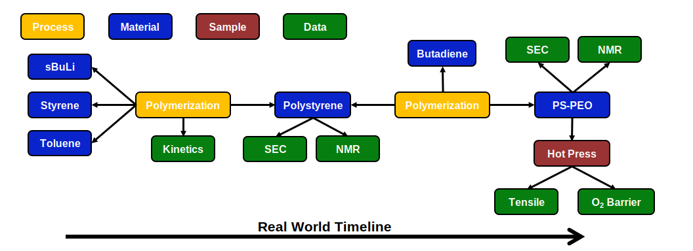
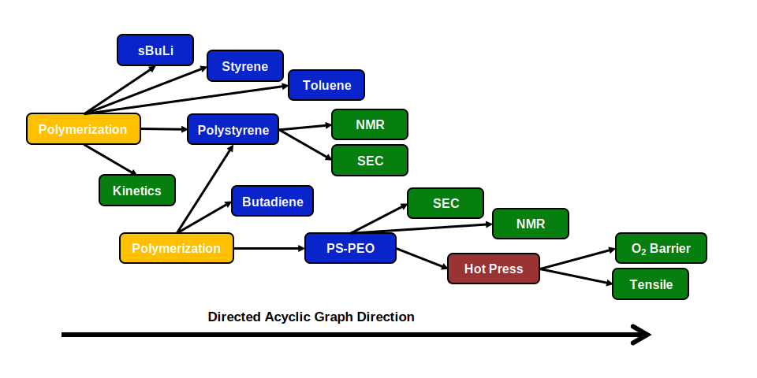

# Example

To show how the data schema can be implemented, we will go through the anionic synthesis of a polystyrene, polybutadiene 
block copolymer through sequential addition of monomers. We will describe the implementation from the perspective of the 
real world experiment timeline as that is likely to be the most intuitive workflow. 

The data schema begins with the definition of material nodes. These first material nodes are the ingredients for the process node.
This will be secbuLi, styrene, and toluene in our example. These materials nodes will contain information such as 
name, SMILES string, CAS number, and property information (molecular weight, boiling point, etc.) The second node to be defined
will be a process node. In this case, it will be a polymerization node. The polymerization node will contain links to 
those initial material nodes as well as the quantities of each material used in the polymerization. The polymerization node
will also contain details for the process in the form of a paragraph, or a list of process parameters. For the anionic polymerization,
this can be details about the order of addition of the chemicals, reaction time, temperature, etc. In the case when data is
taken about a process, a link to data node can be made. Something like polymerization kinetics where concentration or molecular weight is monitored over time.
The third node to be defined is another material node, or product of the process. Polystyrene in this case. 
The process node will link to this product material node. Any characterization data from aliquots can be added through a data node.
The material node will link to the relevant data nodes. In our example, SEC raw data or NMR spectra can be found in the data nodes,
while the calculated values like M~n~, M~w~, M~w~/M~n~, etc. would be found in the property section of the polystyrene node.

The synthesis for the second block, polybutadiene, continues with the definition of the butadiene material node. 
This can be followed by the definition of a second polymerization node which will point to the product of the whole process, 
polystyrene-polybutadiene block copolymer. Similar to the polystyrene characterization, the SEC and NMR data can be placed into data nodes.
With this final target material made additional material studies, like tensile testing or oxygen barrier properties, may be done.
In this case, there may be some material preparation steps such as hot pressing the sample into a dog bone. This can be placed into a sample
node. This sample node contains the material preparation steps and any characterization data that occurred on the sample.

We can also visualize the exact same example in the context of a direct acyclic graph.

Example where they buy the polymer