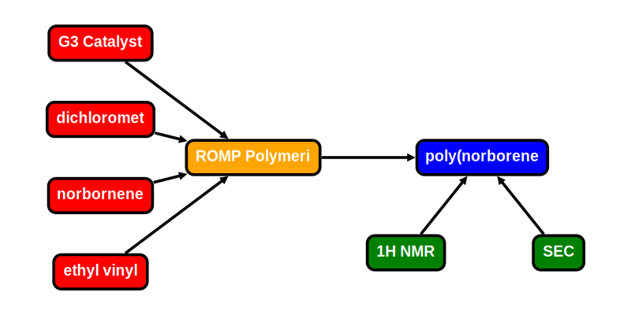

# Experiment

The 'experiment' node contains complete set of references nodes for an experiment. An experiment can range from a 
synthesis, to scattering experiment, or a simulation. A single experiment is meant to capture a single, or a linear 
set of processes. For non-linear processes (like running multiple reactions for optimizations, kinetics, etc.) [collections](../data-models/Collections.md) are preferred. 

**Features:**

* experiment can reference materials, process, sample, data
* required information  
    * name
    * materials, process, sample, data nodes 
* optional information
    * references
    * notes
* auto generate/update:
    * _id
    * class
    * version_schema
    * version_control (& all child) <-- update with version control node
    * date (& all child)
  
**App features to support this node:**

* a page to fill out: experiment(materials, process, sample, data) data
* allow additional optional information in attribute section given that it begins with +


## JSON Schema

```json
{
  "_id": objectId(),
  "class": "expt",
  "version_schema": string,
  "version_control": {
    "_id": objectId(),
    "num": string
  },
  "date_created": datetime,
  "date_last_mod": datetime,
  "name": string,
  "nodes": {
    "materials": [
      {"_id": objectid(), "name": string, "role": string}
    ],
    "process": [
      {"_id": objectid(), "name": string}
    ],
    "sample": [
      {"_id": objectid(), "name": string, "id_link": objectid()}
    ],
    "data": [
      {"_id": objectid(), "name": string, "id_link": objectid()}
    ]
  },
  "optional attributes"
}
```

---

## Description

Key             |Data Type     |Required  |Description
-------------   |---------     |------    |----
`_id`                 |<span style="color:rgb(0, 72, 189)"> objectId() </span>   | <span style="color:rgb(0, 72, 189)">  auto  </span> | <span style="color:rgb(0, 72, 189)">  unique database id  </span>
`class`               |<span style="color:rgb(0, 72, 189)">  string  </span>     | <span style="color:rgb(0, 72, 189)">  auto  </span> | <span style="color:rgb(0, 72, 189)">  class of node  </span>
`version_schema`      |<span style="color:rgb(0, 72, 189)">  string  </span>     | <span style="color:rgb(0, 72, 189)">  auto  </span> | <span style="color:rgb(0, 72, 189)">  schema version; Ex: "v0.1"  </span>
`version_control`     |                                                          |                                                     | <span style="color:rgb(0, 72, 189)">  version control object  </span>
`version_control/_id` |<span style="color:rgb(0, 72, 189)">  objectId()  </span> | <span style="color:rgb(0, 72, 189)">  auto  </span> | <span style="color:rgb(0, 72, 189)">  reference id to node history  </span>
`version_control/num` |<span style="color:rgb(0, 72, 189)">  string  </span>     | <span style="color:rgb(0, 72, 189)">auto  </span>   | <span style="color:rgb(0, 72, 189)">  type of node ; Ex: "group"  </span>
`date_created`        |<span style="color:rgb(0, 72, 189)">  datetime  </span>   | <span style="color:rgb(0, 72, 189)">auto  </span>   | <span style="color:rgb(0, 72, 189)">  datetime created  </span>
`date_last_mod`       |<span style="color:rgb(0, 72, 189)">  datetime  </span>   | <span style="color:rgb(0, 72, 189)">auto  </span>   | <span style="color:rgb(0, 72, 189)">  last modified datetime  </span>
`name`                    | string        | required  | name of experiment
`nodes`                   | dict          |           | list of nodes that constitute an experiment
`nodes/materials`         | list[dict]    |           | [material nodes](../data-models/Materials_P.md)
`nodes/materials/_id`     | objectId()    | auto      | id of material
`nodes/materials/name`    | string        | auto      | name of material
`nodes/materials/role`    | string        | auto      | material role [ingr, prod]
`nodes/process`           | list[dict]    |           | [process nodes](../data-models/Process.md)
`nodes/process/_id`       | objectId()    | auto      | id of process
`nodes/process/name`      | string        | auto      | name of process
`nodes/sample`            | list[dict]    |           | [sample nodes](../data-models/Sample.md)
`nodes/sample/_id`        | objectId()    | auto      | id of sample
`nodes/sample/name`       | string        | auto      | name of sample
`nodes/sample/id_link`    | objectId()    | auto      | id of the material the sample points 
`nodes/data`              | list[dict]    |           | [data nodes](../data-models/Data.md)
`nodes/data/_id`          | objectId()    | auto      | id of data
`nodes/data/name`         | string        | auto      | name of data
`nodes/data/id_link`      | objectId()    | auto      | id of the node the data points


### Attributes

Attributes are optional properties that can be associated with this node. The following list is the officially supported
keys. Users may define their own keys by placing a '+' in front of their custom key.

Key                | Data Type      | Description
-------------      |---------       |----
`reference`        | list[dict]     | reference for this experiment
`reference\doi`    | string         | [DOI: digital object identifier](https://www.doi.org/)
`reference\title`  | string         | reference title
`note`             | string         | free-form space to store any text


---

## Example

```json
{
  "_id": "607f191e810c19729de860ea",
  "type": "expt",
  "ver_sch": "v0.1",
  "ver_con": {
    "_id": "607f191e810c19729de860eb",
    "num": "v0.1"
  },
  "date": [
    {"created": 1612889382},
    {"last_mod": 1612889322}
  ],
  "notes": "CRIPT development team is funded by NSF Convergence Accelerator.",
  "users": [
    {"_id": "507f191e810c19729de860ec", "name": "Dylan W", "perm": "w"}
  ],
  "name": "ROMP kinetic study",
  "nodes": {
    "materials": [
      {"_id": "507f191e810c19729de860ec", "name": "G3 Catalyst", "_idproc": "507f191e810c19729de860pe", "role": "ingr"},
      {"_id": "507f191e810c19729de860ed", "name": "dichloromethane", "_idproc": "507f191e810c19729de860pe", "role": "ingr"},
      {"_id": "507f191e810c19729de860ee", "name": "norbornene-imide", "_idproc": "507f191e810c19729de860pe", "role": "ingr"},
      {"_id": "507f191e810c19729de860ef", "name": "ethyl vinyl ether", "_idproc": "507f191e810c19729de860pe", "role": "ingr"},
      {"_id": "507f191e810c19729de860ds", "name": "poly(norborene-imide)", "_idproc": "507f191e810c19729de860pe", "role": "prod"}
    ],
    "process": [
      {"_id": "507f191e810c19729de860pe", "name": "ROMP polymerization", "_idout": "507f191e810c19729de860ds"}
    ],
    "data": [
      {"_id": "507f191e810c19729de860md", "name": "1H NMR", "_idprod": "507f191e810c19729de860ds", "_idprod": "507f191e810c19729de860ds"},
      {"_id": "507f191e810c19729de860me", "name": "SEC", "_idprod": "507f191e810c19729de860ds", "_idprod": "507f191e810c19729de860ds"}
    ]
  },
  "attr": {
    "pub": [
      {"_id": "507f191e810c19729de860em", "title": "Kinetic Study of Living Ring-Opening Metathesis Polymerization"}
    ],
    "ref": [
      {"_id": "507f191e810c19729de860en", "title": "Kinetic Study of Anionic Living Polymerization"}
    ]
  }
}
```

### Visualization


The reaction network can be generated out of `node`.

