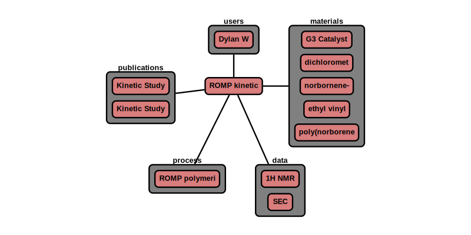

# Experiment

The 'experiment' node contains complete set of references nodes for an experiment. An experiment can range from a synthesis, to scattering experiment, or
a simulation. A single experiment has can only have one process node.

**Features:**

* experiment parents references are collections
* experiment child references are materials, process, sample, data
* required information  
    * name
    * materials, process, sample, data nodes 
* optional information
    * notes
    * keywords
    * publications (CRIPT node)
    * references (publication CRIPT node)
* auto generate/update:
    * _id
    * type
    * ver_sch
    * ver_con (& all child) <-- update with version control node
    * date (& all child)
    * creater (& all child) <-- update with user node
    * nodes (materials, process, data) <-- update with node
    * pub (& all child) <-- update with publication node
    * ref (& all child) <-- update with publication node

**App features to support this node:**

* a page to fill out: experiment(materials, process, data) data
* a tool to look up publications, or enter _id
* allow additional optional information in attribute section given that it begins with +


## JSON Schema

```json
{
  "_id": objectId(),
  "type": "expt",
  "ver_sch": string,
  "ver_con": {
    "_id": objectId(),
    "num": string
  },
  "date": [
    {"created": datetime},
    {"last_mod": datetime}
  ],
  "notes": string,
  "creator": {"_id": objectId(), "name": string, "perm": string},
  "name": string,
  "nodes": {
    "materials": [
      {"_id": objectid(), "name": string, "role": string}
    ],
    "process": {"_id": objectid(), "name": string},
    "sample": [
      {"_id": objectid(), "name": string, "id_link": objectid()}
    ],
    "data": [
      {"_id": objectid(), "name": string, "id_link": objectid()}
    ]
  },
  "attr": {
    "see attributes": "for details"
  }
}
```

---

## Description

Key             |Data Type     |Required  |Description
-------------   |---------     |------    |----
`_id`           |<span style="color:rgb(0, 72, 189)"> objectId() </span>|<span style="color:rgb(0, 72, 189)">  auto  </span>|<span style="color:rgb(0, 72, 189)">  unique database id  </span>
`type`          |<span style="color:rgb(0, 72, 189)">  string  </span> |<span style="color:rgb(0, 72, 189)">  auto  </span>|<span style="color:rgb(0, 72, 189)">  type of node ; Ex: "group"  </span>
`ver_sch`       |<span style="color:rgb(0, 72, 189)">  string  </span>|<span style="color:rgb(0, 72, 189)">  auto  </span>|<span style="color:rgb(0, 72, 189)">  schema version; Ex: "v0.1"  </span>
`ver_con`       |              |          |<span style="color:rgb(0, 72, 189)">  version control object  </span>
`ver_con/_id`   |<span style="color:rgb(0, 72, 189)">  objectId()  </span>|<span style="color:rgb(0, 72, 189)">  auto  </span>|<span style="color:rgb(0, 72, 189)">  reference id to node history  </span>
`ver_con/num`   |<span style="color:rgb(0, 72, 189)">  string  </span>|<span style="color:rgb(0, 72, 189)">auto  </span>|<span style="color:rgb(0, 72, 189)">  type of node ; Ex: "group"  </span>
`date`          |              |          |<span style="color:rgb(0, 72, 189)">  datetime object  </span>
`date/created`  |<span style="color:rgb(0, 72, 189)">  datetime  </span>|<span style="color:rgb(0, 72, 189)">auto  </span>|<span style="color:rgb(0, 72, 189)">  datetime created  </span>
`type/last_mod` |<span style="color:rgb(0, 72, 189)">  datetime  </span>|<span style="color:rgb(0, 72, 189)">auto  </span>|<span style="color:rgb(0, 72, 189)">  last modified datetime  </span>
`notes`         |<span style="color:rgb(0, 72, 189)">  string  </span>|<span style="color:rgb(0, 72, 189)">auto  </span> |<span style="color:rgb(0, 72, 189)">  free-form space to store any text  </span>
`creator`         |     |      |<span style="color:rgb(12, 145, 3)">  user permissions   </span>
`creator/_id`           |<span style="color:rgb(12, 145, 3)">  objectId()   </span>|<span style="color:rgb(12, 145, 3)">  auto   </span>|<span style="color:rgb(12, 145, 3)">  creator user id  </span>
`creator/name`          |<span style="color:rgb(12, 145, 3)">  string  </span>|<span style="color:rgb(12, 145, 3)">  auto   </span>|<span style="color:rgb(12, 145, 3)">  user name  </span>
`creator/perm`          |<span style="color:rgb(12, 145, 3)">  string  </span>|<span style="color:rgb(12, 145, 3)">  auto   </span>|<span style="color:rgb(12, 145, 3)">  permission level; [r: read, w: write, a: append] </span>
`name`                    | string        | required  | name of experiment
`nodes`                   |               |           | list of nodes that constitute an experiment
`nodes/materials`         |               |           | [material nodes](../data-models/Materials_P.md)
`nodes/materials/_id`     | objectId()    | auto      | id of material
`nodes/materials/name`    | string        | auto      | name of material
`nodes/materials/_idproc` | objectId()    | auto      | id of process material used in
`nodes/materials/role`    | string        | auto      | material role [ingr, prod]
`nodes/process`           |               |           | [process nodes](../data-models/Process.md)
`nodes/process/_id`       | objectId()    | auto      | id of process
`nodes/process/name`      | string        | auto      | name of process
`nodes/data/_idout`       | objectId()    | auto      | id of the node the process points to [material, data]
`nodes/data`              |               |           | [data nodes](../data-models/Data.md)
`nodes/data/_id`          | objectId()    | auto      | id of data
`nodes/data/name`         | string        | auto      | name of data
`nodes/data/_idprod`       | objectId()    | auto     | id of material the data is associated with data
`attr`                    | list          | auto      | see attributes section

### Attributes

Attributes are optional properties that can be associated with this node. The following list is the officially supported
keys. Users may define their own keys by placing a '+' in front of their custom key.

Key                | Data Type     | Description
-------------      |---------      |----
`keywords`         | list[string]  | see keywords section below
`pub`              |               | [publication node](../data-models/Publications.md) that this experiment was a part of
`pub\_id`          | objectId()    | id for publication
`pub\title`        | string        | publication title
`ref`              |               | [publication node](../data-models/Publications.md) that was a reference for this experiment
`ref\_id`          | objectId()    | id for reference
`ref\title`        | string        | reference title

#### Keywords (still under development)

Keywords are an optional field that allow users to classify the experiment. Selecting multiple keywords is allowed.

* synthesis
* chain growth
* living_poly
* controlled_poly
* radical_poly
* rop
* romp
* atrp
* nmp
* raft
* step_growth
* condensation
* extrusion
* blow_molding
* film
* fiber
* scattering
* rheology

---

## Example

```json
{
  "_id": "607f191e810c19729de860ea",
  "type": "expt",
  "ver_sch": "v0.1",
  "ver_con": {
    "_id": "607f191e810c19729de860eb",
    "num": "v0.1"
  },
  "date": [
    {"created": 1612889382},
    {"last_mod": 1612889322}
  ],
  "notes": "CRIPT development team is funded by NSF Convergence Accelerator.",
  "users": [
    {"_id": "507f191e810c19729de860ec", "name": "Dylan W", "perm": "w"}
  ],
  "name": "ROMP kinetic study",
  "nodes": {
    "materials": [
      {"_id": "507f191e810c19729de860ec", "name": "G3 Catalyst", "_idproc": "507f191e810c19729de860pe", "role": "ingr"},
      {"_id": "507f191e810c19729de860ed", "name": "dichloromethane", "_idproc": "507f191e810c19729de860pe", "role": "ingr"},
      {"_id": "507f191e810c19729de860ee", "name": "norbornene-imide", "_idproc": "507f191e810c19729de860pe", "role": "ingr"},
      {"_id": "507f191e810c19729de860ef", "name": "ethyl vinyl ether", "_idproc": "507f191e810c19729de860pe", "role": "ingr"},
      {"_id": "507f191e810c19729de860ds", "name": "poly(norborene-imide)", "_idproc": "507f191e810c19729de860pe", "role": "prod"}
    ],
    "process": [
      {"_id": "507f191e810c19729de860pe", "name": "ROMP polymerization", "_idout": "507f191e810c19729de860ds"}
    ],
    "data": [
      {"_id": "507f191e810c19729de860md", "name": "1H NMR", "_idprod": "507f191e810c19729de860ds", "_idprod": "507f191e810c19729de860ds"},
      {"_id": "507f191e810c19729de860me", "name": "SEC", "_idprod": "507f191e810c19729de860ds", "_idprod": "507f191e810c19729de860ds"}
    ]
  },
  "attr": {
    "keywords": ["synthesis", "living_poly", "romp", "kinetics"],
    "pub": [
      {"_id": "507f191e810c19729de860em", "title": "Kinetic Study of Living Ring-Opening Metathesis Polymerization"}
    ],
    "ref": [
      {"_id": "507f191e810c19729de860en", "title": "Kinetic Study of Anionic Living Polymerization"}
    ]
  }
}
```

### Visualization



The reaction network can be generated out of `node`.

