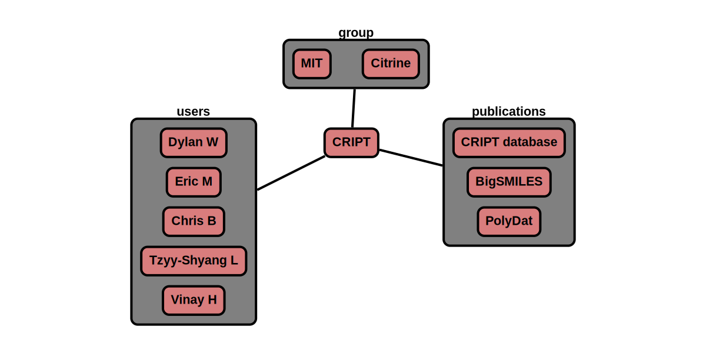

# Groups

The 'group' node contains data related to a group which is a collection of users.

Example of groups are MIT, Citrine, CRIPT development team, or a research group.
They can be big organizations or small groups of only two users.

**Features:**

* groups within groups are allowed
* groups can reference users, groups, publications
* required information  
    * name
    * collection list (CRIPT node)
* optional information
    * notes
    * child group (CRIPT node)
    * website
    * email
* auto generate/update:
    * _id
    * type
    * ver_sch
    * ver_con (& all child) <-- update with version control node
    * date (& all child)
    * users_num <-- auto calculate

  

**App features to support this node:**

* a page to fill out: name, website, email, etc.
* a tool to look up users, or enter _id
* a similar look up tool for groups, and publications
* allow additional optional information in attribute section given that it begins with +

## JSON Schema

```json
{
  "_id": objectId(),
  "type": "group",
  "ver_sch": string,
  "ver_con": {
    "_id": objectId(),
    "num": string
  },
  "date": [
    {"created": datetime},
    {"last_mod": datetime}
  ],
  "name": string,
  "users_num": double,
  "users_list": [
    {"_id": objectId(), "name": string}
  ],
  "optional Attributes"
}
```

---

## Description

Key             |Data Type     |Required  |Description
-------------   |---------     |------    |----
`_id`          |<span style="color:rgb(0, 72, 189)"> objectId() </span>|<span style="color:rgb(0, 72, 189)">  auto  </span>|<span style="color:rgb(0, 72, 189)">  unique database id  </span>
`type`          |<span style="color:rgb(0, 72, 189)">  string  </span> |<span style="color:rgb(0, 72, 189)">  auto  </span>|<span style="color:rgb(0, 72, 189)">  type of node ; Ex: "group"  </span>
`ver_sch`       |<span style="color:rgb(0, 72, 189)">  string  </span>|<span style="color:rgb(0, 72, 189)">  auto  </span>|<span style="color:rgb(0, 72, 189)">  schema version; Ex: "v0.1"  </span>
`ver_con`       |              |          |<span style="color:rgb(0, 72, 189)">  version control object  </span>
`ver_con/_id`   |<span style="color:rgb(0, 72, 189)">  objectId()  </span>|<span style="color:rgb(0, 72, 189)">  auto  </span>|<span style="color:rgb(0, 72, 189)">  reference id to node history  </span>
`ver_con/num`   |<span style="color:rgb(0, 72, 189)">  string  </span>|<span style="color:rgb(0, 72, 189)">auto  </span>|<span style="color:rgb(0, 72, 189)">  type of node ; Ex: "group"  </span>
`date`          |              |          |<span style="color:rgb(0, 72, 189)">  datetime object  </span>
`date/created`  |<span style="color:rgb(0, 72, 189)">  datetime  </span>|<span style="color:rgb(0, 72, 189)">auto  </span>|<span style="color:rgb(0, 72, 189)">  datetime created  </span>
`type/last_mod` |<span style="color:rgb(0, 72, 189)">  datetime  </span>|<span style="color:rgb(0, 72, 189)">auto  </span>|<span style="color:rgb(0, 72, 189)">  last modified datetime  </span>
`notes`         |<span style="color:rgb(0, 72, 189)">  string  </span>|<span style="color:rgb(0, 72, 189)">auto  </span> |<span style="color:rgb(0, 72, 189)">  free-form space to store any text  </span>
`users`         |     |      |<span style="color:rgb(12, 145, 3)">  user permissions   </span>
`users/_id`           |<span style="color:rgb(12, 145, 3)">  objectId()   </span>|<span style="color:rgb(12, 145, 3)">  auto   </span>|<span style="color:rgb(12, 145, 3)">  user id  </span>
`users/name`          |<span style="color:rgb(12, 145, 3)">  string  </span>|<span style="color:rgb(12, 145, 3)">  auto   </span>|<span style="color:rgb(12, 145, 3)">  user name  </span>
`users/perm`          |<span style="color:rgb(12, 145, 3)">  string  </span>|<span style="color:rgb(12, 145, 3)">  auto   </span>|<span style="color:rgb(12, 145, 3)">  permission level; [r: read, w: write, a: append] </span>
`name`                 | string        | required      | name of group
`owner`                | string        |               | type of node ; Ex: "group"
`owner/_id`            | objectId()    | auto          | type of node ; Ex: "group"
`owner/name`           | string        | required      | type of node ; Ex: "group"
`users_num`            |               |               | [number of users in the group](../data-models/Users.md)
`users_list`           | string        | auto          | list of users in the group
`users_list/_id`       | objectId()    | auto          | id of user
`users_list/name`      | string        | auto          | name of user
`attr`                 | dict          |               | see attributes section

### Attributes

Attributes are optional properties that can be associated with this node. The following list is the officially supported
keys. Users may define their own keys by placing a '+' in front of their custom key.

Key                   | Data Type       | Description
-------------         |---------        |----
`par_group`           |                 | [parent group](../data-models/Groups.md)
`par_group\_id`       | objectId()      | id of parent group
`par_group\name`      | string          | name of parent group
`chi_group`           |                 | [child group](../data-models/Groups.md)
`chi_group\_id`       | objectId()      | id of child group
`chi_group\name`      | string          | name of child group
`pub`                 |                 | [publication node](../data-models/Publications.md) that this experiment was a part of
`pub\_id`             | objectId()      | id for publication
`pub\title`           | string          | publication title
`coll`                |                 | [collection nodes](../data-models/Collections.md)
`coll\_id`            | objectId()      | id of collection
`coll\name`           | string          | name of collection
`coll\date`           | datetime        | date of collection
`coll\date\num_expt`  | double          | number of experiments in collection
`web`                 | string          | website of group
`email`               | string          | group email address

---

## Example

```json
{
  "_id": "507f191e810c19729de860ea",
  "type": "group",
  "ver_sch": "v0.1",
  "ver_con": {
    "_id": "507f191e810c19729de860eb",
    "num": "v0.1"
  },
  "date": [
    {"created": 1612889182},
    {"last_mod": 1612889122}
  ],
  "notes": "CRIPT development team is funded by NSF Convergence Accelerator.",
  "name": "CRIPT",
  "owner": {"_id": "507f191e810c19729de860ec", "name": "Dylan W"},
  "users_num": 5,
  "users_list": [
    {"_id": "507f191e810c19729de860ec", "name": "Dylan W"},
    {"_id": "507f191e810c19729de860ed", "name": "Eric M"},
    {"_id": "507f191e810c19729de860ee", "name": "Chris B"},
    {"_id": "507f191e810c19729de860ef", "name": "Tzyy-Shyang L"},
    {"_id": "507f191e810c19729de860eg", "name": "Vinay H"}
  ],
  "attr": {
    "par_group": [
      {"_id": "507f191e810c19729de860em", "name": "MIT"},
      {"_id": "507f191e810c19729de860en", "name": "Citrine"}
    ],
    "pub": [
      {"_id": "507f191e810c19729de860em", "title": "CRIPT database"},
      {"_id": "507f191e810c19729de860em", "title": "bigSMILES"},
      {"_id": "507f191e810c19729de860em", "title": "PolyDat"}
    ],
    "web": "https://cript.mit.edu/",
    "email": "cript@mit.edu"
  }
}
```

### Visualization

