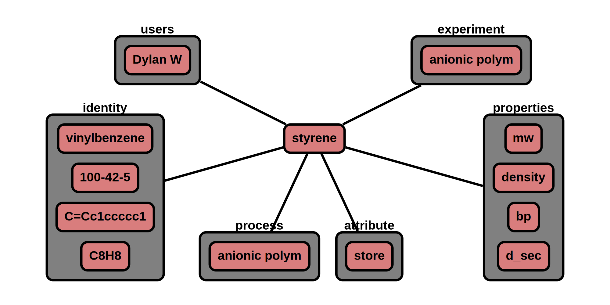

# Materials - other

The 'material' node contains data related to a chemical. This material node is specifically tailored for small molecules 
and inorganics.

**Features:**

* material node points to process nodes (multiple process nodes are allowed)
* process, data nodes point to material nodes (multiple data nodes are allowed, single process node allowed)
* required information  
    * name
    * iden, prop (user should populate with some details)
    * expt, proc, data (will be populated as it's linked to other nodes)
* optional information
    * source
    * lot_num
    * storage conditions
* auto generate/update:
    * id_
    * type
    * ver_sch
    * ver_con (& all child) <-- update with version control node
    * date (& all child)
    * users (& all child) <-- update with user node
    * expt (& all child)  <-- update with expt node
    * proc (& all child) <-- update with proc node
    * data (& all child) <-- update with data node

**App features to support this node:**

* a page to fill out: experiment(materials, process, data) data
* allow additional optional information in attribute, **iden, prop** section given that it begins with +
* units are not stored and all official values are converted to database standard prior to storage


## JSON Schema

```json
{
  "id_": objectId(),
  "type": "material",
  "ver_sch": string,
  "ver_con": {
    "id_": objectId(),
    "num": string
  },
  "date": [
    {"created": datetime},
    {"last_mod": datetime}
  ],
  "notes": string,
  "users": [
    {"id_": objectId(), "name": string, "perm": string}
  ],
  "name": string,
  "expt": [
    {"id_": objectId(), "name": string}
  ],
  "iden": {
    "see identifiers": "for details"
  },
  "prop": {
    "see properties": "for details"
  },
  "proc": [
    {"id_": objectId(), "name": string, "role": string}
  ],
  "data": [
    {"id_": objectId(), "name": string}
  ],
  "attr": {
    "see attributes": "for details"
  }
}
```

---

## Description

Key             |Data Type     |Required  |Description
-------------   |---------     |------    |----
`id_`          |<span style="color:rgb(0, 72, 189)"> objectId() </span>|<span style="color:rgb(0, 72, 189)">  auto  </span>|<span style="color:rgb(0, 72, 189)">  unique database id  </span>
`type`          |<span style="color:rgb(0, 72, 189)">  string  </span> |<span style="color:rgb(0, 72, 189)">  auto  </span>|<span style="color:rgb(0, 72, 189)">  type of node ; Ex: "group"  </span>
`ver_sch`       |<span style="color:rgb(0, 72, 189)">  string  </span>|<span style="color:rgb(0, 72, 189)">  auto  </span>|<span style="color:rgb(0, 72, 189)">  schema version; Ex: "v0.1"  </span>
`ver_con`       |              |          |<span style="color:rgb(0, 72, 189)">  version control object  </span>
`ver_con/id_`   |<span style="color:rgb(0, 72, 189)">  objectId()  </span>|<span style="color:rgb(0, 72, 189)">  auto  </span>|<span style="color:rgb(0, 72, 189)">  reference id to node history  </span>
`ver_con/num`   |<span style="color:rgb(0, 72, 189)">  string  </span>|<span style="color:rgb(0, 72, 189)">auto  </span>|<span style="color:rgb(0, 72, 189)">  type of node ; Ex: "group"  </span>
`date`          |              |          |<span style="color:rgb(0, 72, 189)">  datetime object  </span>
`date/created`  |<span style="color:rgb(0, 72, 189)">  datetime  </span>|<span style="color:rgb(0, 72, 189)">auto  </span>|<span style="color:rgb(0, 72, 189)">  datetime created  </span>
`type/last_mod` |<span style="color:rgb(0, 72, 189)">  datetime  </span>|<span style="color:rgb(0, 72, 189)">auto  </span>|<span style="color:rgb(0, 72, 189)">  last modified datetime  </span>
`notes`         |<span style="color:rgb(0, 72, 189)">  string  </span>|<span style="color:rgb(0, 72, 189)">auto  </span> |<span style="color:rgb(0, 72, 189)">  free-form space to store any text  </span>
`users`         |     |      |<span style="color:rgb(12, 145, 3)">  user permissions   </span>
`users/id_`           |<span style="color:rgb(12, 145, 3)">  objectId()   </span>|<span style="color:rgb(12, 145, 3)">  auto   </span>|<span style="color:rgb(12, 145, 3)">  user id  </span>
`users/name`          |<span style="color:rgb(12, 145, 3)">  string  </span>|<span style="color:rgb(12, 145, 3)">  auto   </span>|<span style="color:rgb(12, 145, 3)">  user name  </span>
`users/perm`          |<span style="color:rgb(12, 145, 3)">  string  </span>|<span style="color:rgb(12, 145, 3)">  auto   </span>|<span style="color:rgb(12, 145, 3)">  permission level; [r: read, w: write, a: append] </span>
`name`                    | string        | required  | name of chemical
`expt`                    |               |           | [experiment nodes](../data-models/Experiments.md)
`expt/id_`                | objectId()    | auto      | id of experiment
`expt/name`               | string        | auto      | name of experiment
`iden`                    |               |           | [see identifiers section](../Materials_P/#identifiers)
`prop`                    |               |           | [see properties section](../Materials_P/#properties)
`process`                 |               |           | [process nodes](../data-models/Process.md)
`process/id_`             | objectId()    | auto      | id of process
`process/name`            | string        | auto      | name of process
`process/role`            | list[string]  | auto      | role of material in process [ingr, prod]
`data`                    |               |           | [data nodes](../data-models/Data.md)
`data/id_`                | objectId()    | auto      | id of data
`data/name`               | string        | auto      | name of data
`attr`                    | list          | auto      | see attributes section

### Attributes

Attributes are optional properties that can be associated with this node. The following list is the officially supported
keys. Users may define their own keys by placing a '+' in front of their custom key.

Key                | Data Type    | Units    | Description
-------------      |---------     |------    | ----
`source`           | string       |          | source of material
`lot_num`          | string       |          | lot number
`store`            |              |          | storage conditions
`store\temp`       | double       | degC     | storage temperature
`store\time_num`   | double       | min      | storage time 
`store\notes`      | string       |          | notes related to storage 


### Identifiers

Identifiers are chemical descriptors or unique ids which speaks to the chemical structure, excluding parameters that
need to be measured (i.e. properties). Providing as many identifiers as possible great facilitate the findability of the
associated data.

Key                  | Data Type      | Required    | Description
-------------        |---------       | ---------   |----
`names`              | list[string]   | required    | Any name for the material
`cas`                | string         | optional    | [CAS number](https://www.cas.org/support/documentation/chemical-substances)
`smiles`             | string         | optional    | [simplified molecular-input line-entry system](https://en.wikipedia.org/wiki/Simplified_molecular-input_line-entry_system)
`chem_form`          | string         | optional    | chemical formula, Ex. benzene: "C6H6"
`id_`                | objectId()     | optional    | id number from CRIPT internal database

### Properties

Properties consist of the following structure:
“key”: {“method”: string, “value”: double, “uncertainty”: double, “attr”: {}}

The range bound is limited to the largest number that can be stored in 64 bits (1.79e+308).

Key              | Method                |Range                |Units      |Description
----------       |---------              |------               |--------   |---------
`ref_index`      | []                    | [0, 1.79e+308]      | None      | a dimensionless number that describes how fast light travels through the material.
`density`        | []                    | [0, 1.79e+308]      | None      | the amount of substance that fit within a unit of volume.
`mw`             | ['nmr', 'maldi']      | [0, 1.79e+308]      | g/mol     | molecular weight 
`conc`           | []                    | [0, 1.79e+308]      | M         | concentration
`bp`             | []                    | [-273.15, 1.79E308] | degC      | boiling temperature
`mp`             | []                    | [-273.15, 1.79E308] | degC      | melting temperature
`vis`            | ['viscometer']        | [0, 1.79e+308]      | dl/g      | viscosity


Key              | Description
----------       | ----
`nmr`            | Nuclear Magnetic Resonance
`sec`            | Size Exclusion Chromatography
`maldi`          | Matrix Assisted Laser Desorption Ionization
`ultra_centr`    | Ultra Centrifugation
`osmtic_pres`    | Osmotic Pressure
`ls`             | Static Light Scattering
`dls`            | Dynamic Light Scattering
`viscometer`     | Viscometer
`calorimetry`    | Calorimetry
`utm`            | Universal Testing Machine
`comp`           | Computation or Simulation

#### Attribute for Properties

Key              | Data Type     |Description
----------       |---------      |----
`ref`            |               | [publication node](../data-models/Publications.md) that was a reference for this experiment
`ref\id_`        | objectId()    | id for reference
`ref\title`      | string        | reference title
`ref\notes`      | string        | for non-publication reference enter the information here      
`data`           |               | [data](../data-models/Data.md)
`data\id_`       | objectId()    | id for data node
`data\key`       | string        | key for data
`names`          | list[string]  | additional names for property
`unit`           | string        | unit are only applicable to user defined values


---

## Example

```json
{
  "id_": "607f191e810c19729de860ea",
  "type": "expt",
  "ver_sch": "v0.1",
  "ver_con": {
    "id_": "607f191e810c19729de860eb",
    "num": "v0.1"
  },
  "date": [
    {"created": 1612889382},
    {"last_mod": 1612889322}
  ],
  "notes": "",
  "users": [
    {"id_": "507f191e810c19729de860ec", "name": "Dylan W", "perm": "w"}
  ],
  "name": "styrene",
  "expt": [
    {"id_": "507f191e810c19729de860em", "name": "anionic polymerization of styrene"}
  ],
  "iden": {
    "names": ["styrene","vinylbenzene", "phenylethylene"],
    "cas": "100-42-5",
    "smiles": "C=Cc1ccccc1",
    "chem_form": "C8H8"
  },
  "prop": [
    {
      "key": "mw", "value": 104.15, "attr": {"ref": {"notes": "sigma aldrich website"}}
    },
    {
      "key": "density", "value": 0.906
    },
    {
      "key": "bp", "value": 145, "attr": {"+vac": "1", "+vac_unit": "atm"}
    }
  ],
  "proc": [
    {"id_": "507f191e810c19729de860em", "name": "anionic polymerization", "role": ["ingr"]}
  ],
  "data": [],
  "attr": {
    "store": {"temp_num": 0, "temp_unit": "degC"},
    "source": "sigma"
  }
}
```

### Visualization



