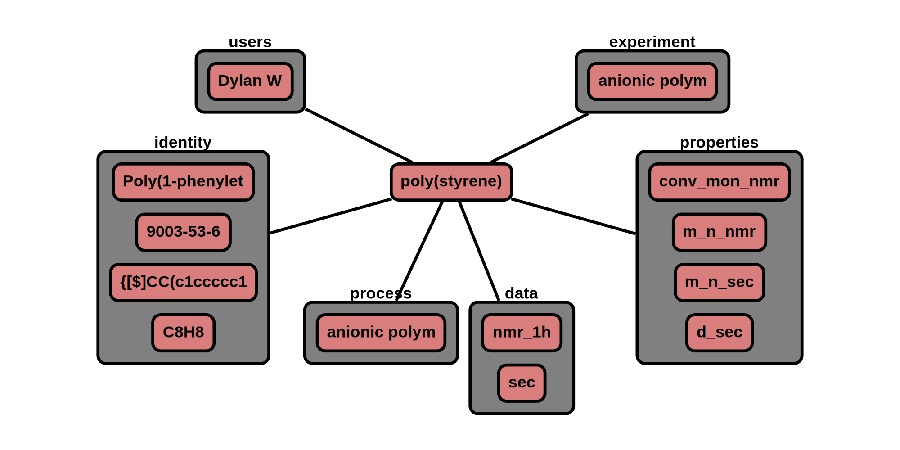

# Materials - Polymer

The 'material' node contains data related to a chemical. This material node is specifically tailored for polymers or 
mixtures containing polymers.

**Features:**

* material node points to process nodes (multiple process nodes are allowed)
* process, data, and sample nodes point to material nodes (multiple data nodes are allowed, single process node allowed)
* required information  
    * name
    * identity
    * references: expt, proc, data, sample (will be populated as it's linked to other nodes)
* optional information
    * property
    * source
    * lot_num
    * storage conditions
* auto generate/update:
    * _id
    * type
    * ver_sch
    * ver_con (& all child) <-- update with version control node
    * date (& all child)
    * expt (& all child)  <-- update with expt node
    * proc (& all child) <-- update with proc node
    * data (& all child) <-- update with data node

**App features to support this node:**

* a page to fill out: experiment(materials, process, data) data
* allow additional optional information in attribute, **iden, prop** section given that it begins with +
* units are not stored and all official values are converted to database standard prior to storage

## JSON Schema

```json
{
  "_id": objectId(),
  "type": "material",
  "ver_sch": string,
  "ver_con": {
    "_id": objectId(),
    "num": string
  },
  "date": [
    {"created": datetime},
    {"last_mod": datetime}
  ],
  "notes": string,
  "expt": [{"_id": objectId(), "name": string}],
  "proc": {"_id": objectId(), "name": string, "role": string},
  "data": [{"_id": objectId(), "name": string}],
  "name": string,
  "iden": {"see identifiers": "for details"},
  "prop": [{"see properties": "for details"}],
  "attr": {"see attributes": "for details"}
}
```

---

## Description

Key                       |Data Type     |Required  |Description
-------------             |---------     |------    |----
`_id`                     |<span style="color:rgb(0, 72, 189)"> objectId() </span>|<span style="color:rgb(0, 72, 189)">  auto  </span>|<span style="color:rgb(0, 72, 189)">  unique database id  </span>
`type`                    |<span style="color:rgb(0, 72, 189)">  string  </span> |<span style="color:rgb(0, 72, 189)">  auto  </span>|<span style="color:rgb(0, 72, 189)">  type of node ; Ex: "group"  </span>
`ver_sch`                 |<span style="color:rgb(0, 72, 189)">  string  </span>|<span style="color:rgb(0, 72, 189)">  auto  </span>|<span style="color:rgb(0, 72, 189)">  schema version; Ex: "v0.1"  </span>
`ver_con`                 |              |          |<span style="color:rgb(0, 72, 189)">  version control object  </span>
`ver_con/_id`             |<span style="color:rgb(0, 72, 189)">  objectId()  </span>|<span style="color:rgb(0, 72, 189)">  auto  </span>|<span style="color:rgb(0, 72, 189)">  reference id to node history  </span>
`ver_con/num`             |<span style="color:rgb(0, 72, 189)">  string  </span>|<span style="color:rgb(0, 72, 189)">auto  </span>|<span style="color:rgb(0, 72, 189)">  type of node ; Ex: "group"  </span>
`date`                    |              |          |<span style="color:rgb(0, 72, 189)">  datetime object  </span>
`date/created`            |<span style="color:rgb(0, 72, 189)">  datetime  </span>|<span style="color:rgb(0, 72, 189)">auto  </span>|<span style="color:rgb(0, 72, 189)">  datetime created  </span>
`type/last_mod`           |<span style="color:rgb(0, 72, 189)">  datetime  </span>|<span style="color:rgb(0, 72, 189)">auto  </span>|<span style="color:rgb(0, 72, 189)">  last modified datetime  </span>
`notes`                   |<span style="color:rgb(0, 72, 189)">  string  </span>|<span style="color:rgb(0, 72, 189)">auto  </span> |<span style="color:rgb(0, 72, 189)">  free-form space to store any text  </span>
`expt`                    |               |<span style="color:rgb(12, 145, 3)">  auto  </span>          | [experiment node](../data-models/Experiments.md)
`expt/_id`                |<span style="color:rgb(12, 145, 3)">  objectId()     </span> |<span style="color:rgb(12, 145, 3)"> auto  </span> |<span style="color:rgb(12, 145, 3)"> id of experiment </span>
`expt/name`               |<span style="color:rgb(12, 145, 3)">  string         </span> |<span style="color:rgb(12, 145, 3)"> auto  </span> |<span style="color:rgb(12, 145, 3)"> name of experiment </span>
`process`                 |               |         </span>  | [process nodes](../data-models/Process.md)
`process/_id`             | <span style="color:rgb(12, 145, 3)">objectId() </span>   |<span style="color:rgb(12, 145, 3)"> auto    </span>  | <span style="color:rgb(12, 145, 3)">id of process </span>
`process/name`            | <span style="color:rgb(12, 145, 3)">string      </span>  |<span style="color:rgb(12, 145, 3)"> auto     </span> | <span style="color:rgb(12, 145, 3)">name of process </span>
`process/role`            | <span style="color:rgb(12, 145, 3)">list[string] </span>  | <span style="color:rgb(12, 145, 3)">auto     </span> | <span style="color:rgb(12, 145, 3)">role of material in process [ingr, prod] </span>
`data`                    |               | optional       | [data node](../data-models/Data.md)
`data/_id`                |<span style="color:rgb(12, 145, 3)">  objectId()     </span> |<span style="color:rgb(12, 145, 3)"> auto  </span> |<span style="color:rgb(12, 145, 3)"> id of data </span>
`data/name`               |<span style="color:rgb(12, 145, 3)">  string         </span> |<span style="color:rgb(12, 145, 3)"> auto  </span> |<span style="color:rgb(12, 145, 3)"> name of data </span>
`name`                    | string        | required  | name of chemical
`iden`                    |               | required  | [see identifiers section](../Materials_P/#identifiers)
`prop`                    |               | optional  | [see properties section](../Materials_P/#properties)
`attr`                    | list          | auto      | see attributes section


### Identifiers

Identifiers are chemical descriptors or unique ids which speaks to the chemical structure. Providing as many 
identifiers as possible great facilitate the findability of the associated data. Additionally, if sufficiently many 
identifiers are provided, the polymer ensemble can be constructed from these values.
Mixtures are supported in this section by appending to list of identifiers.

The identifiers are split into two groups: Primary and Secondary. Primary identifiers are non-experimentally dertermined
values. Secondary identifiers are experimentally determined chemical descriptors. Units are only used for user
defined attributes which begin with a `+`. 'id' here is a 'double' and represents the idea of the component. 

```json
{'id':{'Key': {"value": string/double, "uncer": double, "unit": string, "method": string, "data":{"_id": ObjectID, "name": string}}}}
```

#### Primary Identifiers
Key                  | Data Type      | Required    | Description
-------------        |---------       | ---------   |----
`names`              | list[string]   | required    | Any name for the material
`cas`                | string         | optional    | [CAS number](https://www.cas.org/support/documentation/chemical-substances)
`bigsmiles`          | string         | optional    | [bigSMILES Line Notation](https://olsenlabmit.github.io/BigSMILES/docs/line_notation.html#the-bigsmiles-line-notation)
`chem_repeat`        | string         | optional    | chemical formula of repeating unit, Ex. polystyrene: "C8H8"
`smiles`             | string         | optional    | [simplified molecular-input line-entry system](https://en.wikipedia.org/wiki/Simplified_molecular-input_line-entry_system)
`chem_form`          | string         | optional    | chemical formula, Ex. benzene: "C6H6"


#### Secondary Identifiers
Key              | Method                                     |Range    |Units      |Description
----------       |---------                                    |------   |--------   |---------
`m_n`            | ['nmr', 'sec', 'maldi', 'osmtic_pres']      | [0, 1.79e+308]      | g/mol      | Average molecular weight on the bases of moles or first moment of the molecular weight distribution.
`m_w`            | ['nmr', 'sec', 'maldi', 'ls']               | [0, 1.79e+308]      | g/mol      | Average molecular weight on the bases of weight.
`d`              | ['sec', 'maldi']                            | [1, 1.79e+308]      |            | Ratio of weight averaged molecular weight over number average molecular weight.
`m_z`            | ['nmr', 'sec', 'maldi', 'ultra_centr']      | [0, 1.79e+308]      | g/mol      |
`m_v`            | ['viscometer']                              | [0, 1.79e+308]      | g/mol      | Average molecular weight determined from viscosity
`mw_std_dev`     | ['nmr', 'sec', 'maldi']                     | [0, 1.79e+308]      | g/mol      | Standard deviation of molecular weight distribution or square root of the second moment ofthe molecular weight distribution
`mw_var`         | ['nmr', 'sec', 'maldi']                     | [0, 1.79e+308]      | g/mol      | Variance of molecular weight distribution or the second moment of the molecular weight distribution
`mw_skew`        | ['nmr', 'sec', 'maldi']                     | [0, 1.79e+308]      | g/mol      | Skewness of molecular weight distribution or the third moment of the molecular weight distribution
`mw_kurtosis`    | ['nmr', 'sec', 'maldi']                     | [0, 1.79e+308]      | g/mol      | Kurtosis of molecular weight distribution or the fourth moment of the molecular weight distribution
`tac_Pm`         | ['nmr']                                     | [0, 1]              |            | probability of finding meso diads (Pm)
`comp_frac`      | []                                          | [0, 1]              |            | composition: mole fraction of component ??????
`branch`

### Properties

Properties consist of the following structure:
```json
{"key":{"id": double, "value": double, "uncer": double, "unit": string, "method": string, "data":{"_id": ObjectID, "name": string}}}
```

"id" is the id from the identifiers.
The range bound is limited to the largest number that can be stored in 64 bits (1.79e+308).

Key              | Method     |Range    |Units      |Description
----------       |---------   |------   |--------   |---------
`ref_index`      | []      | [0, 1.79e+308]      | None      | A dimensionless number that describes how fast light travels through the material.
`density`        | []      | [0, 1.79e+308]      | None      | The amount of substance that fit within a unit of volume.
`t_m`            | ['dsc']      | [-273.15, 1.79e+308]      | degC      | The transition temperature where crystal structures are destroyed.
`t_g`            | ['dsc']      | [-273.15, 1.79e+308]      | degC      | The transition temperature where a substances turns into a glass; vitrification.
`crys_frac`      | ['dsc']      | [0, 1.2]      | None      | Percent Crystallinity By Weight
`enth_crys`      | ['dsc']      | [-1.79e+308, 1.79e+308]      | J/mol      | Enthalpy of Crystallization, molar basis
`entr_crys`      | ['dsc']      | [-1.79e+308, 1.79e+308]      | J/mol/K      | Entropy of Crystallization, molar basis
`therm_cond`      | []      | [0, 1.79e+308]      | W/m/k      | Measure of a materials ability to conduct heat
`therm_expand_v`      | []      | [-1.79e+308, 1.79e+308]      | 1/K      | A change in volume in response to a change in temperature (not including phase transitions)
`therm_expand_l`      | []      | [-1.79e+308, 1.79e+308]      | 1/K      | A change in dimension in response to a change in temperature (not including phase transitions)
`c_p`      | ['calorimetry', 'dsc']      | [-1.79e+308, 1.79e+308]      | J/mol/K      | The amount of heat needed to be supplied to a given mole (based on repeat unit) to produce a change in temperature at constant pressure
`c_v`      | []      | [-1.79e+308, 1.79e+308]      | J/mol/K      | The amount of heat needed to be supplied to a given mole (based on repeat unit) to produce a change in temperature at constant volume
`therm_diff`      | []      | [-1.79e+308, 1.79e+308]      | m^2/s      | A measures the rate of transfer of heat of a material from the hot end to the cold end.
`tensile_mod`      | ['utm']      | [0, 1.79e+308]      | GPa      |
`tensile_str`      | ['utm']      | [0, 1.79e+308]      | MPa      | The maximum stress that a material can withstand while being stressed.
`yield_str`      | ['utm']      | [0, 1.79e+308]      | MPa      | Point on a stress-strain curve that indicates the limit of elastic behavior.
`frac_strain`      | ['utm']      | [1, 1.79e+308]      | None      | The maximum strain that a material can withstand while being stressed.
`intr_vis`      | ['viscometer']      | [0, 1.79e+308]      | dl/g      | A measure of a solute contribution to the viscosity of a solution
`mh_parameter_k`      | ['sec', 'viscometer']      | [0, 1.79e+308]      | ml/g      | Mark Houwink Parameters provide a relation between intrinsic viscosity and molecular weight
`mh_parameter_a`      | ['sec', 'viscometer']      | [0, 1.79e+308]      | None      | Mark Houwink Parameters provide a relation between intrinsic viscosity and molecular weight
`diff_coef`      | []      | [0, 1.79e+308]      | cm^2/s      | Proportionality constant between the molar flux due to molecular diffusion and the gradient of concentration.
`relax_time_seg`      | []      | [0, 1.79e+308]      | s      | Time it takes a polymer segement to relax
`relax_time_long`      | []      | [0, 1.79e+308]      | s      | Time longest time scale it takes to relax an applied stress
`iso_comp`      | []      | [-1.79e+308, 1.79e+308]      | m^2/N      | A change in volume in response to a change in pressure
`char_ratio`      | []      | [0, 1.79e+308]      | None      | A measure of chain flexibility.
`khun_len`      | []      | [0, 1.79e+308]      | angstrom      | A measure of chain flexibility.
`stat_seg_len`      | []      | [0, 1.79e+308]      | angstrom      | A measure of chain flexibility.
`persis_len`      | []      | [0, 1.79e+308]      | angstrom      | A measure of the bending stiffness of a polymer.
`r_g`      | ['ls']      | [0, 1.79e+308]      | nm      | The root-mean-square mass weighted average distance of monomers from the center of mass.
`r_h`              | ['dls']      | [0, 1.79e+308]      | nm      | The radius of an equivalent hard-sphere diffusing at the same rate as the molecule under observation
`virial_coef`      | []      | [0, 1.79e+308]      | cm^3 * mole/gram^2      |
`inter_Parm`      | []      | [0, 1.79e+308]      | cm^3 * mole/gram^2      | A measure of the interaction between molecules and the medium in which it is dissolved in.

Key                | Description
----------         | ----
`nmr`              | Nuclear Magnetic Resonance
`sec`              | Size Exclusion Chromatography
`maldi`            | Matrix Assisted Laser Desorption Ionization
`ultra_centr`      | Ultra Centrifugation
`osmtic_pres`      | Osmotic Pressure
`ls`               | Static Light Scattering
`dls`              | Dynamic Light Scattering
`viscometer`       | Viscometer
`calorimetry`      | Calorimetry
`utm`              | Universal Testing Machine
`comp`             | Computation or Simulation

### Attributes

Attributes are optional properties that can be associated with this node. The following list is the officially supported
keys. Users may define their own keys by placing a '+' in front of their custom key.

Key                | Data Type    | Units    | Description
-------------      |---------     |------    | ----
`source`           | string       |          | source of material
`lot_num`          | string       |          | lot number
`store`            |              |          | storage conditions
`store\temp`       | double       | degC     | storage temperature
`store\time_num`   | double       | min      | storage time 
`store\notes`      | string       |          | notes related to storage  

---

## Example

```json
{
  "_id": "607f191e810c19729de860ea",
  "type": "expt",
  "ver_sch": "v0.1",
  "ver_con": {
    "_id": "607f191e810c19729de860eb",
    "num": "v0.1"
  },
  "date": [
    {"created": 1612889382},
    {"last_mod": 1612889322}
  ],
  "notes": "",
  "users": [
    {"_id": "507f191e810c19729de860ec", "name": "Dylan W", "perm": "w"}
  ],
  "name": "poly(styrene)",
  "expt": [
    {"_id": "507f191e810c19729de860em", "name": "anionic polymerization of styrene"}
  ],
  "iden": {
    "names": ["Poly(1-phenylethene)"],
    "cas": "9003-53-6",
    "bigsmiles": "{[$]CC(c1ccccc1)[$]}",
    "chem_repeat": "C8H8"
  },
  "prop": [
    {
      "key": "conv_mon", "method": "NMR", "value": 0.98, "uncertainty": 0.03,
      "attr": {"data": {"_id": "507f191e810c19729de860em", "key": "nmr_1h"}}
    },
    {
      "key": "m_n", "method": "nmr", "value": 5300, "uncertainty": 300,
      "attr": {"data": {"_id": "507f191e810c19729de860em", "key": "nmr_1h"}, "names": ["end group analysis"]}
    },
    {
      "key": "m_n", "method": "sec", "value": 5130, "uncertainty": 200,
      "attr": {"data": {"_id": "507f191e810c19729de860em", "key": "sec"}}
    },
    {
      "key": "d", "method": "sec", "value": 1.03, "uncertainty": 0.02,
      "attr": {"data": {"_id": "507f191e810c19729de860em", "key": "sec"}}
    }
  ],
  "proc": [
    {"_id": "507f191e810c19729de860em", "name": "anionic polymerization", "role": ["prod"]}
  ],
  "data": [
    {"_id": "507f191e810c19729de860ef", "key": "nmr_1h"},
    {"_id": "507f191e810c19729de860vm", "key": "sec"}
  ],
  "attr": {}
}
```

### Visualization


