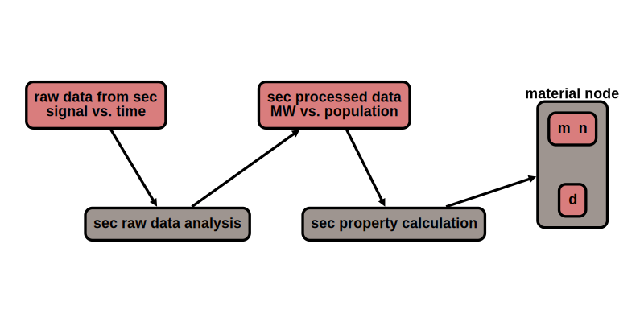

# Model Lake

**under construction**

Modules are computation nodes. They input a data node, preform a mathematical operation, and result in either 
another 'processed' data node or a material property.

## Example
red are data nodes

gray are module nodes

output is properties in a material node

