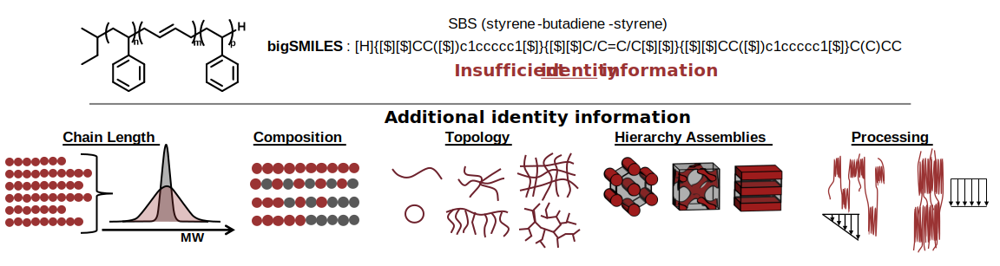
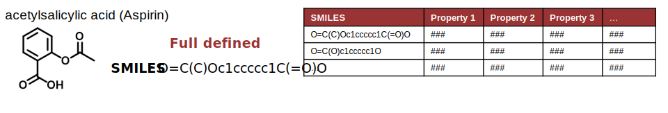
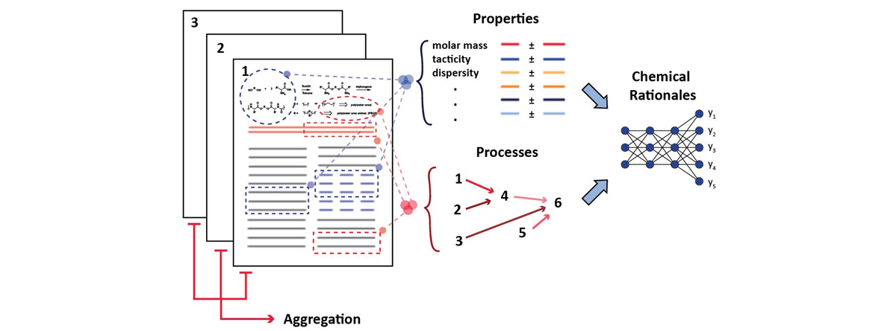

# Challenges of Polymer Data

Polymers are large stochastic molecules which can assemble in hierarchical structures depending on processing conditions.
Ultimately, this means that there is no single representation that can capture the full molecular detail of a polymer material. 
This lack of a single identifier provides a significant challenge for large scale data analysis.

Polymers are a result of a system of stochastic reactions. This leads to distributions in chain length, composition, and 
topology making it impossible to completely represent a polymer in a single quantity. The combination of a structural 
description (like a chemical drawing or bigSMILES), and distribution information would be required to completely define 
the identity of a polymer. In practice, moments of distributions (average molecular weight) or ratio of composition are 
provided to approximately define a polymer as they are easier to work with and experimentally obtain. Moreover, 
data collection methods are highly variable, and typically provide relative structure information and/or use of 
theoretical models which requires expert knowledge to put into context. In some cases experimentally obtaining structural 
information is impossible, and information from prior processing steps is needed. To complicate the matters further, 
polymers can assemble into a wide range of structures through phenomena like phase segregation and crystallization. 
The formation of these structures can be highly influenced by the processing conditioning under which the material was made. 
Ultimately, this makes polymer-informatics messy as datasets that do not completely capture all the relevant polymer data 
will be incapable of providing reliable data and hindering large data science efforts.

 

## Comparison to small molecules 
Molecule-property tuple/pair style of data storage relates desired properties with the structures of a molecule. 
Data in this format fits naturally into widely available and well-supported database technologies, which store data in a
series of tables relating molecular properties with the corresponding chemical descriptors. Assimilating data from 
different sources is straightforward as the chemical descriptors can be used unambiguously to define the chemical system 
and provide a handle to collate and aggregate distinct instances of data for the same chemical object.
For most molecules, this information is conveniently encoded with representations that detail their chemical connectivity, 
such as SMILES ([simplified molecular-input line-entry system](https://en.wikipedia.org/wiki/Simplified_molecular-input_line-entry_system)) strings for organic molecules, 
nucleic acid sequences for RNA, or amino acid sequences for proteins.

## Natural Language Processing (NLP) for polymer data

Extracting polymer information with natural language processing is considerably is very challenging and this challenge 
is even larger for polymers than small molecules because there is no uniform nomenclature (typically generic terminology used), 
figures of polymer structure are extremely high variability, and ultimately a combination of figures, raw data, generic 
terminology and expert knowledge are all needs to define a polymer structure and to put into context.  Thus, 
hindering the generation of reliable databases from prior literature. Nevertheless, the CRIPT
initiative seeks to create the tools to address this challenge. 

## Current Polymer Databases

Currently, for most available datasets, polymer entries are identified through names of the polymers and lack complete
characterization data. This leads to ambiguity and incompleteness in molecular structure specification.

* Bicerano, J., Prediction of Polymer Properties, 3rd Edition. CRC Press: 2002, DOI: [10.1201/9780203910115](https://doi.org/10.1201/9780203910115).
* Brandrup, J.; Immergut, E. H.; Grulke, E. A.; Abe, A.; Bloch, D. R., [Polymer Handbook](https://www.wiley.com/en-us/Polymer+Handbook%2C+2+Volumes+Set%2C+4th+Edition-p-9780471479369). Wiley New York: 1999.
* Polymer Property Predictor and Database. [http://pppdb.uchicago.edu/](http://pppdb.uchicago.edu/) 
* Otsuka, S.; Kuwajima, I.; Hosoya, J.; Xu, Y.; Yamazaki, M. PoLyInfo: Polymer Database for Polymeric Materials Design. 2011, IEEE, 22– 29, DOI: [10.1109/EIDWT.2011.13](10.1109/EIDWT.2011.13).
* Mark, J. E., Physical Properties of Polymers Handbook. Springer: 2007,  DOI: [10.1007/978-0-387-69002-5](https://doi.org/10.1007/978-0-387-69002-5).
* CHEMnetBASE - Polymers: a Property Database. [http://poly.chemnetbase.com/faces/polymers/PolymerSearch.xhtml](http://poly.chemnetbase.com/faces/polymers/PolymerSearch.xhtml) 
* NanoMine. [http://materialsmine.org/nm](http://materialsmine.org/nm)
* Chemical Retrieval on the Web (CROW) [https://www.polymerdatabase.com/](https://www.polymerdatabase.com/)
* Polymer Genome [https://www.polymergenome.org/](https://www.polymergenome.org/)

## Other Material Data Models

The CRIPT data structure was not the first design to address the complexities of polymer material data storage. 
PolyDAT and GEMD were both previouslyed develop and were a large inspiration to the CRIPT data structure.  

**PolyDAT** [J. Chem. Inf. Model. 2021, doi: 10.1021/acs.jcim.1c00028](https://pubs.acs.org/doi/10.1021/acs.jcim.1c00028)

PolyDAT is a schema developed by a team led by [Brad Olsen](https://olsenlab.mit.edu/) at MIT and focuses on specifying the 
molecular structures of polymers and associate chemical characterization. The schema was designed around a single
document based schema that is well suited for publication supporting information. 

**GEMD** [https://citrineinformatics.github.io/gemd-docs/](https://citrineinformatics.github.io/gemd-docs/)

GEMD is a schema developed by [Citrine Informatics](https://citrine.io/) to model materials and associated data. 
GEMD stands for Graphical Expression of Materials Data. The schema was designed around data objects
making it well suited for large database projects. 

