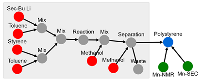

# Process

The 'process' node contains ingredient list, quantities, and procedure information. A process can be anything from a reaction,
reaction + separation, reactive extrusion. Typically, a process results in a change in the [identity](../Materials_P/#identifiers) or [property](../Materials_P/#properties).

**Features:**

* process node points to materials and data
* required information
    * name
    * ingredient (material CRIPT node) 
    * procedure
* optional information
    * data (CRIPT node)
    * conditions
    * properties
    * keywords 
    * history  
    * note
* auto generate/update:
    * _id
    * class
    * version_schema
    * version_control (& all child) <-- update with version control node
    * date (& all child)


**App features to support this node:**

* allow additional optional information in `cond` section given that it begins with +
* units are not stored for officially supported data as all official values are converted to database standard prior to storage

## JSON Schema

```json
{
  "_id": objectId(),
  "class": "process",
  "version_schema": string,
  "version_control": {
    "_id": objectId(),
    "num": string
  },
  "date_created": datetime,
  "date_last_mod": datetime,
  "name": string,
  "ingredients": ["see ingredients for details"],
  "procedure": string,
  "optional attributes"
}
```

---


## Description

Key                   |Data Type     |Required  |Description
-------------         |---------     |------    |----
`_id`                 |<span style="color:rgb(0, 72, 189)"> objectId() </span>   | <span style="color:rgb(0, 72, 189)">  auto  </span> | <span style="color:rgb(0, 72, 189)">  unique database id  </span>
`class`               |<span style="color:rgb(0, 72, 189)">  string  </span>     | <span style="color:rgb(0, 72, 189)">  auto  </span> | <span style="color:rgb(0, 72, 189)">  class of node  </span>
`version_schema`      |<span style="color:rgb(0, 72, 189)">  string  </span>     | <span style="color:rgb(0, 72, 189)">  auto  </span> | <span style="color:rgb(0, 72, 189)">  schema version; Ex: "v0.1"  </span>
`version_control`     |                                                          |                                                     | <span style="color:rgb(0, 72, 189)">  version control object  </span>
`version_control/_id` |<span style="color:rgb(0, 72, 189)">  objectId()  </span> | <span style="color:rgb(0, 72, 189)">  auto  </span> | <span style="color:rgb(0, 72, 189)">  reference id to node history  </span>
`version_control/num` |<span style="color:rgb(0, 72, 189)">  string  </span>     | <span style="color:rgb(0, 72, 189)">auto  </span>   | <span style="color:rgb(0, 72, 189)">  type of node ; Ex: "group"  </span>
`date_created`        |<span style="color:rgb(0, 72, 189)">  datetime  </span>   | <span style="color:rgb(0, 72, 189)">auto  </span>   | <span style="color:rgb(0, 72, 189)">  datetime created  </span>
`date_last_mod`       |<span style="color:rgb(0, 72, 189)">  datetime  </span>   | <span style="color:rgb(0, 72, 189)">auto  </span>   | <span style="color:rgb(0, 72, 189)">  last modified datetime  </span>
`name`                    | string        | required  | name of process
`ingredients`             | list[dict]    | required  | [see ingredients section](../Process/#ingredients)
`procedure`               | string        | required  | written procedure for the process


### Attributes

Attributes are optional properties that can be associated with this node. The following list is the officially supported
keys. Users may define their own keys by placing a '+' in front of their custom key.

Key                | Data Type    | Description
-------------      | ---------    | ----
`data`             | list[dict]   | [data node](../data-models/Data.md)
`data/_id`         | objectId()   | id of data
`data/name`        | string       | name of data
`data/type`        | string       | type of data
`conditions`       | list[dict]   | [see conditions section](../Process/#conditions)
`properties`       | list[dict]   | [see properties section](../Process/#properties)
`keywords`         | list[string] | [see keywords section below](../Process/#keywords)
`history`          | dict         | [processing history](../Process/#process history)
`note`             | string       | free-form space to store any text


### Ingredients

Ingredients are originally defined as a [material node](../data-models/Materials_P.md) and linked here. A minimum of 1
quantity is required, and `type` is optional. List of supported quantities (quant), units and valid ranges. 
Units are not stored as all values are converted to database standard prior to storage.

```json
{
  "_id": objectId(),
  "name": string,
  "type": string,
  "quantities": [
    {"key": string, "value": double, "uncer": double}
  ]
}
```

type            | Description
-----           | ----
monomer         | the major chemical to be incorporated into a repeating unit of a polymer
polymer         | a chemical that consists of a large number of similar units bonded together
initiator       | a chemical which starts the growth of a polymer
catalyst        | a chemical that increases the rate of a chemical reaction
solvent         | an inert liquid that facilitates a reaction  
cta             | chain transfer agent, a chemical added to the reaction resulting in the exchange of the propagating site 
quench          | a chemical which terminates the chemical reaction
reagent         | a chemical which is chemical reacts during the course of the process
workup          | a chemical used in the purification or isolation of a polymer

##### Quantities

Key                | Units      | Range          | Description
-------------      |----------- | ----           |-----------
`mass`             | g          | [0, 1.79e+308] | mass
`volume`           | ml         | [0, 1.79e+308] | volume
`pressure`         | kPa        | [0, 1.79e+308] | partial pressure
`mole`             | mmol       | [0, 1.79e+308] | mole
`equivalence`      |            | [0, 1.79e+308] | equivalence
`mass_fraction`    |            | [0, 1]         | mass fraction; = mass of ingredient / (mass of all ingredients)
`mole_fraction`    |            | [0, 1]         | mole fraction; = mole of ingredient / (moles of all ingredients)
`vol_fraction`     |            | [0, 1]         | volume fraction; = volume of ingredient / (volume of all ingredients)


### Conditions

Conditions are any process variable that the user would like to explicitly expose. Conditions such as temperature,
pressure, or reaction times are examples. The conditions are stored in a dictionary. Units are only used for user
defined attributes which begin with a `+`. For complex data sets or time series, users are encouraged to put that information
into a data node.

```json
{
  "key": string, 
  "method": string, 
  "value": double, 
  "uncer": double, 
  "unit": string,
  "data": {"_id": ObjectID, "name": string, "type": string}, 
  "note": "string"
}
```

`key`                 | Units         | Description
-------------         | ----          | ----
`time`                | min           | time
`temperature`         | degC          | temperature
`pressure`            | kPa           | pressure (absolute)
`inert`               |               | bool [1 - inert, 0 - Not inert]; reaction occurred under an inert atmosphere (N2, Ar)
`light_power`         | watt          | light power
`light_power_area`    | mwatt*cm**-2  | irradiance 
`light_wlength`       | nm            | wave length of light
`stirring`            | rpm           | revolutions per minute for stirrer
`potential`           | volt          | electrical potential


### Properties

Properties consist of the following structure:

```json
{
  "key": string, 
  "method": string, 
  "value": double, 
  "uncer": double, 
  "unit": string,
  "data": {"_id": ObjectID, "name": string, "type": string}, 
  "note": "string"
}
```

Key              | Method              | Range            | Units     | Description
----------       |---------            |------            |--------   |---------
`conv_mon`       | ['nmr', 'sec']      | [0, 1.2]         | None      | how much monomer that has reacted
`conv_init`      | ['nmr', 'sec']      | [0, 1.2]         | None      | how much initiator that has reacted
`init_eff`       | ['nmr', 'sec']      | [0, 1.2]         | None      | The proportion of initiators that result in an active propagating species
`selectivity`    | []                  | [0,, 1.79e+308]  | None      |
`yield`
`rates`

#### Keywords 

Keywords are an optional field that allow users to classify the experiment. Selecting multiple keywords is allowed.

Keyword                         | Description  
----                            | ----
** chemical transformations **  |
polymerization                  | a chemical reaction that convert monomer(s) to a polymer
kinetics                        | an experiment were multiple data points are take over a span of time
chain_growth                    | [chain growth polymerization](https://en.wikipedia.org/wiki/Chain-growth_polymerization)
step_growth                     | [step-growth polymerization](https://en.wikipedia.org/wiki/Step-growth_polymerization)
post_poly_mod                   | a chemical reaction preformed on a polymer to modify the chemical functionality
living_poly                     | [living polymerization](https://en.wikipedia.org/wiki/Living_polymerization)
controlled_poly                 | a polymerization that produce narrowly dispersed polymers (Ð<1.2)
immortal_poly                   | a polymerization where chain transfer reaction and termination is reversible 
||
radical_poly                    | [Free radical polymerization](https://en.wikipedia.org/wiki/Radical_polymerization)
rop                             | [ring-opening polymerization](https://en.wikipedia.org/wiki/Ring-opening_polymerization) (excluding ROMP)
romp                            | [ring-opening metathesis polymerization](https://en.wikipedia.org/wiki/Ring-opening_metathesis_polymerisation)
atrp                            | [atom transfer radical polymerization](https://en.wikipedia.org/wiki/Atom_transfer_radical_polymerization)
nmp                             | [nitroxide-mediated radical polymerization](https://en.wikipedia.org/wiki/Nitroxide-mediated_radical_polymerization)
raft                            | [reversible addition−fragmentation chain-transfer polymerization](https://en.wikipedia.org/wiki/Reversible_addition%E2%88%92fragmentation_chain-transfer_polymerization)
anionic                         | [anionic addition polymerization](https://en.wikipedia.org/wiki/Anionic_addition_polymerization)
cationic                        | [cationic polymerization](https://en.wikipedia.org/wiki/Cationic_polymerization)
insertion                       | [coordination insertion polymerization](https://en.wikipedia.org/wiki/Coordination_polymerization)
lewis-pairs                     | a polymerization that employs a Lewis acid and a Lewis base to activate/initiate the polymerization
group-transfer                  | a polymerization that proceeds through the repetitive Michael addition
||
bulk                            | [bulk polymerization](Bulk polymerization)
emulsion                        | [emulsion polymerization](https://en.wikipedia.org/wiki/Emulsion_polymerization)
suspension                      | [suspension polymerization](https://en.wikipedia.org/wiki/Suspension_polymerization)
solution                        | [solution polymerization](https://en.wikipedia.org/wiki/Solution_polymerization)
interfacial                     | [interfacial polymerization](https://en.wikipedia.org/wiki/Interfacial_polymerization)
** physical transformations **  |
reactive_processing             |
extrusion                       |
blow_molding                    |
self_assembly                   |
curing                          |
forming                         |
coating                         |
annealing                       |
sol_annealing                   |

### Process history

**Under construction**
The process history is a feature in development. The feature will take the `procedure` given by an user and convert it
into an expand-graph detailing intermediate steps. This feature will be powered by a NLP algorithm that is under
development.



---

## Example

```json
{
  "_id": "507f191e810c19729de860ec",
  "type": "process",
  "ver_sch": "v0.1",
  "ver_con": {
    "_id": "507f191e810c19729de860cb",
    "num": "v0.1"
  },
  "date": [
    {"created": 1612889183},
    {"last_mod": 1612889123}
  ],
  "notes": "",
  "expt": {"_id": "507f191e810c19729de860em", "name": "anionic polymerization of styrene"},
  "data": [{"_id": "507f191e810c19729de860em", "name": "NMR Kinetics"}],
  "product": [{"_id": "507f191e810c19729de5d0em", "name": "polystyrene"}],
  "name": "polymerization",
  "ingr": [
    { 
      "_id": "507f191e810c19729de860em",
      "name": "styrene",
      "chem_form": "C8H8",
      "quantities": [
        {"type": "mass", "value": 20.3},
        {"type": "vol", "value": 22.3},
        {"type": "mole", "value": 195},
        {"type": "equiv", "value": 50}
      ]
    },
    {
      "_id": "507f191e810c19729de560em",
      "name": "sec-bu li",
      "chem_form": "C4H9Li1",
      "quantities": [
        {"type": "vol", "value": 3},
        {"type": "mole", "value": 3.9},
        {"type": "equiv", "value": 1}
      ]
    },
    {
      "_id": "507f191e810c19729de560em",
      "name": "toluene",
      "chem_form": "C7H8",
      "quantities": [
        {"type": "mass", "value": 188},
        {"type": "vol", "value": 216},
        {"type": "mole", "value": 2039},
        {"type": "equiv", "value": 522}
      ]
    },
    {
      "_id": "507f191e810c19729de560em",
      "name": "methanol",
      "chem_form": "C1H4O1",
      "quantities": [
        {"type": "mass", "value": 2.37},
        {"type": "vol", "value": 3},
        {"type": "mole", "value": 74},
        {"type": "equiv", "value": 19}
      ]
    }
  ],
  "procedure": "In an argon filled glovebox, a round bottom flask was filled with 216 ml of dried toluene. The solution of secBuLi (3 ml, 3.9 mmol) was added next, followed by styrene (22.3 g, 176 mmol) to initiate the polymerization. The reaction mixture immediately turned orange. After 30 min, the reaction was quenched with the addition of 3 ml of methanol. The polymer was isolated by precipitation in methanol 3 times and dried under vacuum.",
  "cond": {
    "time": {"value": [60]},
    "temp": {"value": [25]}
  },
  "attr": {}
}
```

