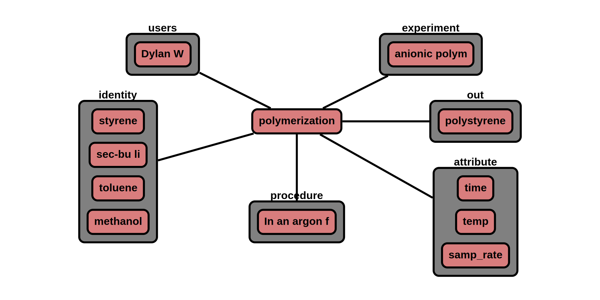

# Process

The 'process' node contains ingredient and procedure information. A process can be anything from a reaction, extrusion,
or sample preparation step.

**Features:**

* material nodes point to process nodes (multiple material nodes are allowed)
* process node points to material or data node (multiple material or data nodes are allowed, but not both material and
  data at the same time)
* required information
    * name
    * ingr (min of one ingr required)
    * procedure
    * expt, out (will be populated as it's linked to other nodes)
* optional information
    * parameters
    * sampling rate
* auto generate/update:
    * id_
    * type
    * ver_sch
    * ver_con (& all child) <-- update with version control node
    * date (& all child)
    * users (& all child) <-- update with user node
    * expt (& all child)  <-- update with expt node
    * ingr (& all child) <-- update with material nodes
    * out (& all child) <-- update with material/data node

**App features to support this node:**

* a page to fill out: experiment(materials, process, data) data
* allow additional optional information in attribute, **para** section given that it begins with +
* units are not stored and all official values are converted to database standard prior to storage

## JSON Schema

```json
{
  "id_": objectId(),
  "type": "process",
  "ver_sch": string,
  "ver_con": {
    "id_": objectId(),
    "num": string
  },
  "date": [
    {"created": datetime},
    {"last_mod": datetime}
  ],
  "notes": string,
  "users": [
    {"id_": objectId(), "name": string, "perm": string}
  ],
  "name": string,
  "expt": [
    {"id_": objectId(), "name": string}
  ],
  "ingr": [
    "see ingredients": "for details"
  ],
  "procedure": string,
  "out": [
    {"type": string, "id_": objectId(), "name": string}
  ],
  "attr": {
    "see attributes": "for details"
  }
}
```

---

## Description

Key             |Data Type     |Required  |Description
-------------   |---------     |------    |----
`id_`          |<span style="color:rgb(0, 72, 189)"> objectId() </span>|<span style="color:rgb(0, 72, 189)">  auto  </span>|<span style="color:rgb(0, 72, 189)">  unique database id  </span>
`type`          |<span style="color:rgb(0, 72, 189)">  string  </span> |<span style="color:rgb(0, 72, 189)">  auto  </span>|<span style="color:rgb(0, 72, 189)">  type of node ; Ex: "group"  </span>
`ver_sch`       |<span style="color:rgb(0, 72, 189)">  string  </span>|<span style="color:rgb(0, 72, 189)">  auto  </span>|<span style="color:rgb(0, 72, 189)">  schema version; Ex: "v0.1"  </span>
`ver_con`       |              |          |<span style="color:rgb(0, 72, 189)">  version control object  </span>
`ver_con/id_`   |<span style="color:rgb(0, 72, 189)">  objectId()  </span>|<span style="color:rgb(0, 72, 189)">  auto  </span>|<span style="color:rgb(0, 72, 189)">  reference id to node history  </span>
`ver_con/num`   |<span style="color:rgb(0, 72, 189)">  string  </span>|<span style="color:rgb(0, 72, 189)">auto  </span>|<span style="color:rgb(0, 72, 189)">  type of node ; Ex: "group"  </span>
`date`          |              |          |<span style="color:rgb(0, 72, 189)">  datetime object  </span>
`date/created`  |<span style="color:rgb(0, 72, 189)">  datetime  </span>|<span style="color:rgb(0, 72, 189)">auto  </span>|<span style="color:rgb(0, 72, 189)">  datetime created  </span>
`type/last_mod` |<span style="color:rgb(0, 72, 189)">  datetime  </span>|<span style="color:rgb(0, 72, 189)">auto  </span>|<span style="color:rgb(0, 72, 189)">  last modified datetime  </span>
`notes`         |<span style="color:rgb(0, 72, 189)">  string  </span>|<span style="color:rgb(0, 72, 189)">auto  </span> |<span style="color:rgb(0, 72, 189)">  free-form space to store any text  </span>
`users`               |     |      |<span style="color:rgb(12, 145, 3)">  user permissions </span>
`users/id_`           |<span style="color:rgb(12, 145, 3)">  objectId()   </span>|<span style="color:rgb(12, 145, 3)">  auto   </span>|<span style="color:rgb(12, 145, 3)">  user id  </span>
`users/name`          |<span style="color:rgb(12, 145, 3)">  string  </span>|<span style="color:rgb(12, 145, 3)">  auto   </span>|<span style="color:rgb(12, 145, 3)">  user name  </span>
`users/perm`          |<span style="color:rgb(12, 145, 3)">  string  </span>|<span style="color:rgb(12, 145, 3)">  auto   </span>|<span style="color:rgb(12, 145, 3)">  permission level; [r: read, w: write, a: append]  </span>
`name`                    | string        | auto       |name of group
`expt`                    |               |            | [experiment nodes](../data-models/Experiments.md)
`expt/id_`                | objectId()    | auto       | id of experiment
`expt/name`               | string        | auto       | name of experiment
`ingr`                    |               |            | [see identifiers section](../Process/#ingredients)
`procedure`               | string        |            | procedure for the process
`out`                     |               |            | the output of the process node
`out/type`                | string        |            | what type of node does the process point to [prod, data]
`out/id_`                 | objectId()    | required   | id of product
`out/name`                | string        | required   | name of product
`attr`                    | list          | auto       | see attributes section

### Attributes

Attributes are optional properties that can be associated with this node. The following list is the officially supported
keys. Users may define their own keys by placing a '+' in front of their custom key.

dict:
```json
{"value": list[double], "units": sting, "uncer": double, "attr": {}}
```
units are only used for user defined attributes

Key                   | Data Type   | Units     | Description
-------------         | ---------    | ----       | ----
`time`                | dict        | min       | time
`temp`                | dict        | degC      | temperature
`pres`                | dict        | kPa       | pressure
`samp_rate`           | dict        | min       | sampling rate
`history`             | dict        |           | processing history (feature under construction)

### Ingredients

Ingredients are originally defined as a [material node](../data-models/Materials_P.md) and linked here.

```json
{
  "id_": objectId(),
  "name": string,
  "chem_form": string,
  "quantities": [
    {"key": string, "value": double, "uncer": double}
  ]
}
```

Key                | Units      | Range          | Description
-------------      |----------- | ----           |-----------
`mass`             | g          | [0, 1.79e+308] | mass
`vol`              | ml         | [0, 1.79e+308] | volume
`pres`             | kPa        | [0, 1.79e+308] | pressure
`mole`             | mmol       | [0, 1.79e+308] | mole
`equiv`            |            | [0, 1.79e+308] | equivalence
`mass_frac`        |            | [0-1]          | mass fraction
`mole_frac`        |            | [0-1]          | mole fraction
`vol_frac`         |            | [0-1]          | volume fraction

## Process history
**Under construction**


---

## Example

```json
{
  "id_": "507f191e810c19729de860ec",
  "type": "process",
  "ver_sch": "v0.1",
  "ver_con": {
    "id_": "507f191e810c19729de860cb",
    "num": "v0.1"
  },
  "date": [
    {"created": 1612889183},
    {"last_mod": 1612889123}
  ],
  "notes": "",
  "users": [
    {"id_": "507f191e810c19729de860ec", "name": "Dylan W", "perm": "w"}
  ],
  "name": "polymerization",
  "expt": [
    {"id_": "507f191e810c19729de860em", "name": "anionic polymerization of styrene"}
  ],
  "ingr": [
    {
      "id_": "507f191e810c19729de860em",
      "name": "styrene",
      "chem_form": "C8H8",
      "quantities": [
        {"type": "mass", "value": 20.3},
        {"type": "vol", "value": 22.3},
        {"type": "mole", "value": 195},
        {"type": "equiv", "value": 50}
      ]
    },
    {
      "id_": "507f191e810c19729de560em",
      "name": "sec-bu li",
      "chem_form": "C4H9Li1",
      "quantities": [
        {"type": "vol", "value": 3},
        {"type": "mole", "value": 3.9},
        {"type": "equiv", "value": 1}
      ]
    },
    {
      "id_": "507f191e810c19729de560em",
      "name": "toluene",
      "chem_form": "C7H8",
      "quantities": [
        {"type": "mass", "value": 188},
        {"type": "vol", "value": 216},
        {"type": "mole", "value": 2039},
        {"type": "equiv", "value": 522}
      ]
    },
    {
      "id_": "507f191e810c19729de560em",
      "name": "methanol",
      "chem_form": "C1H4O1",
      "quantities": [
        {"type": "mass", "value": 2.37},
        {"type": "vol", "value": 3},
        {"type": "mole", "value": 74},
        {"type": "equiv", "value": 19}
      ]
    }
  ],
  "procedure": "In an argon filled glovebox, a round bottom flask was filled with 216 ml of dried toluene. The solution of secBuLi (3 ml, 3.9 mmol) was added next, followed by styrene (22.3 g, 176 mmol) to initiate the polymerization. The reaction mixture immediately turned orange. After 30 min, the reaction was quenched with the addition of 3 ml of methanol. The polymer was isolated by precipitation in methanol 3 times and dried under vacuum.",
  "out": [
    {"type": "prod", "id_": "507f191e810c19729de5d0em", "name": "polystyrene"}
  ],
  "attr": {
    "time": {"value": [60]},
    "temp": {"value": [25]},
    "samp_rate": {"value": [1, 2, 5, 10, 20, 40, 60]}
  }
}
```

### Visualization

