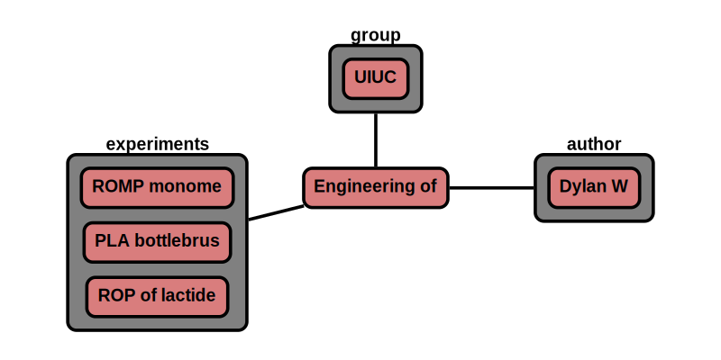

# Publications

The 'publication' node contains data related to a publication. Publication nodes can be generated at any time in the
research process, and experiments can be associated with the publication. The version number can be used to determine
the stage of the publication.

**Features:**

* publication can reference users, groups, experiments
* required information
    * experiments (CRIPT node)
* optional information
    * notes
    * title
    * authors
    * journal
    * publisher
    * year
    * vol
    * issue
    * pages
    * doi
    * issn
    * arxiv_id
    * PMID
    * website
    * user (CRIPT node)
    * group (CRIPT node)

* auto generate/update:
    * _id
    * type
    * ver_sch
    * ver_con (& all child) <-- update with version control node
    * date (& all child)
    * users (& all child) <-- update with user node
    * expt (& all child) <-- update with expt node
    * users (& all child) <-- update with user node
    * group (& all child) <-- update with group node

**App features to support this node:**

* a page to fill out publication details
* a tool to look up experiments, or enter _id
* a similar look up tool for users, and groups
* allow additional optional information in attribute section given that it begins with +

#### Version label

`ver_con/num`    |version stage
-------------    |---------
v0.#.#           | general use or pre-publication
v1.#.#           | staged for publication (submitted for review)
v2.#.#           | publication (and revisions)
v3.#.#           | post-publication (external data analysis)

## JSON Schema

```json
{
  "_id": objectId(),
  "type": "pub",
  "ver_sch": string,
  "ver_con": {
    "_id": objectId(),
    "num": string
  },
  "date": [
    {"created": datetime},
    {"last_mod": datetime}
  ],
  "notes": string,
  "users": [
    {"_id": objectId(), "name": string, "perm": string}
  ],
  "expt": [
    {"_id": objectId(), "name": string, "product": string}
  ],
  "attr": {
    "see attributes": "for details"
  }
}
```

---

## Description

Key                   |Data Type     |Required  |Description
-------------         |---------     |------    |----
`_id`                 |<span style="color:rgb(0, 72, 189)"> objectId() </span>|<span style="color:rgb(0, 72, 189)">  auto  </span>|<span style="color:rgb(0, 72, 189)">  unique database id  </span>
`type`                |<span style="color:rgb(0, 72, 189)">  string  </span> |<span style="color:rgb(0, 72, 189)">  auto  </span>|<span style="color:rgb(0, 72, 189)">  type of node ; Ex: "group"  </span>
`ver_sch`             |<span style="color:rgb(0, 72, 189)">  string  </span>|<span style="color:rgb(0, 72, 189)">  auto  </span>|<span style="color:rgb(0, 72, 189)">  schema version; Ex: "v0.1"  </span>
`ver_con`             |              |          |<span style="color:rgb(0, 72, 189)">  version control object  </span>
`ver_con/_id`         |<span style="color:rgb(0, 72, 189)">  objectId()  </span>|<span style="color:rgb(0, 72, 189)">  auto  </span>|<span style="color:rgb(0, 72, 189)">  reference id to node history  </span>
`ver_con/num`         |<span style="color:rgb(0, 72, 189)">  string  </span>|<span style="color:rgb(0, 72, 189)">auto  </span>|<span style="color:rgb(0, 72, 189)">  type of node ; Ex: "group"  </span>
`date`                |              |          |<span style="color:rgb(0, 72, 189)">  datetime object  </span>
`date/created`        |<span style="color:rgb(0, 72, 189)">  datetime  </span>|<span style="color:rgb(0, 72, 189)">auto  </span>|<span style="color:rgb(0, 72, 189)">  datetime created  </span>
`type/last_mod`       |<span style="color:rgb(0, 72, 189)">  datetime  </span>|<span style="color:rgb(0, 72, 189)">auto  </span>|<span style="color:rgb(0, 72, 189)">  last modified datetime  </span>
`notes`               |<span style="color:rgb(0, 72, 189)">  string  </span>|<span style="color:rgb(0, 72, 189)">auto  </span> |<span style="color:rgb(0, 72, 189)">  free-form space to store any text  </span>
`users`               |              |      |<span style="color:rgb(12, 145, 3)">  user permissions  </span>
`users/_id`           |<span style="color:rgb(12, 145, 3)">  objectId()   </span>|<span style="color:rgb(12, 145, 3)">  auto   </span>|<span style="color:rgb(12, 145, 3)">  user id  </span>
`users/name`          |<span style="color:rgb(12, 145, 3)">  string  </span>|<span style="color:rgb(12, 145, 3)">  auto   </span>|<span style="color:rgb(12, 145, 3)">  user name  </span>
`users/perm`          |<span style="color:rgb(12, 145, 3)">  string  </span>|<span style="color:rgb(12, 145, 3)">  auto   </span>|<span style="color:rgb(12, 145, 3)">  permission level; [r: read, w: write, a: append]  </span>
`expt`               |             |           | [experiment nodes](../data-models/Experiments.md)
`expt/_id`           | objectId()  | auto      | id for experiment
`expt/name`          | string      | auto      | name for experiment
`expt/prod`          | string      | auto      | main product of experiment
`attr`                | list        | auto      |see attributes section

### Attributes

Attributes are optional properties that can be associated with this node. The following list is the officially supported
keys. Users may define their own keys by placing a '+' in front of their custom key.

Key                   |Data Type      |Description
-------------         |---------      |----
`title`               | string         | publication title
`authors`             | list[string]   | authors
`author`               |                | [user details of authors if on platform](../data-models/Users.md)
`author\_id`           | objectId()     | author id
`author\name`          | string         | author name
`journal`             | string         | journal
`publisher`           | string         | publisher
`year`                | int            | publishing year
`vol`                 | int            | volume number
`issue`               | int            | issue number
`pages`               | string         | page number
`doi`                 | string         | [DOI: digital object identifier](https://www.doi.org/)
`issn`                | string         | [ISSN: international standard serial number](https://www.issn.org/)
`arxiv_id`            | string         | [arXiv identifier](https://arxiv.org/)
`PMID`                | string         | [PubMed ID](https://pubmed.ncbi.nlm.nih.gov/)
`web`                 | string         | publication website
`group`               |                | [groups that the user belongs to](../data-models/Groups.md)
`group\_id`           | objectId()     | id of group
`group\name`          | string         | name of group

---

## Example

```json
{
  "_id": "507f191e810c19729de861ec",
  "type": "pub",
  "ver_sch": "v0.1",
  "ver_con": {
    "_id": "507f191e810c19729de861cb",
    "num": "v2.1"
  },
  "date": [
    {"created": 1612881183},
    {"last_mod": 1612881123}
  ],
  "notes": "",
  "users": [
    {"_id": "507f191e810c19729de860ec", "name": "Dylan W", "perm": "w"}
  ],
  "expt": [
    {"_id": "507f191e810c19729de860em", "name": "ROMP monomer order kinetic study", "date": 1612886423},
    {"_id": "507f191e810c19729de860en", "name": "PLA bottlebrush synthesis", "date": 1612886423},
    {"_id": "507f191e810c19729de860ej", "name": "ROP of lactide kinetics", "date": 1612886423}
  ],
  "attr": {
    "title": "Engineering of Molecular Geometry in Bottlebrush Polymers",
    "authors": ["Walsh, Dylan J.", "Dutta, Sarit", "Sing, Charles E.", "Guironnet, Damien"],
    "author": [
      {"_id": "507f191e810c19729de860ec", "name": "Dylan W"}
    ],
    "journal": "Macromolecules",
    "publisher": "American Chemical Society",
    "year": "2019",
    "vol": 52,
    "issue": 13,
    "page": "4847-4857",
    "doi": "10.1021/acs.macromol.9b00845",
    "issn": "0024-9297",
    "web": "http://pubs.acs.org/doi/10.1021/acs.macromol.9b00845",
    "group": [
      {"_id": "507f191e810c19729de860em", "name": "UIUC"}
    ]
  }
}
```

### Visualization



