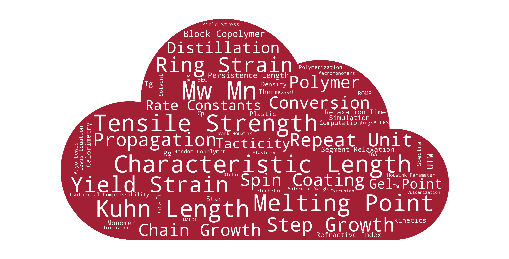
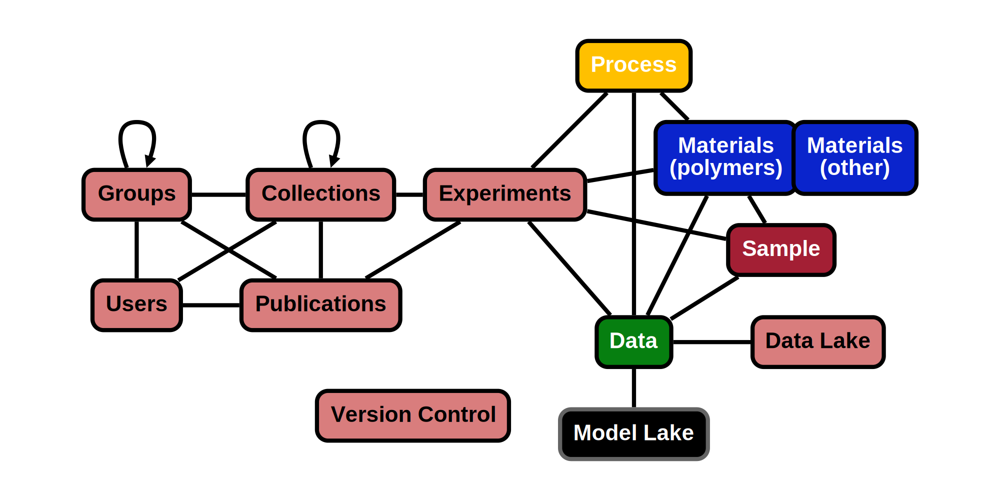

# Overview
As part of CRIPTS mission to develop an ecosystem for polymers, there was a need to generate a standard data model and 
schema to share polymer data. The following documentation details with the way in which polymer data is represented and 
stored and within the CRIPT ecosystem.

## Importance
Having accessible well-structured data is the foundation of cheminformatics. The complexity of polymer 
structures with the wide range of characterization techniques and properties poses significant challenges in the 
formation of databases. This has led to several small, disparate data sets. The data structure presented here provides a
universal system to capture all relevant polymer data in a manner optimized for large databases. It is designed to allow 
anyone to contribute for the benefit of the polymer community; with to goal to ultimately speed the pace of material innovation.

---

## Philosophy

### Reporting Guidelines
Reporting guidelines refers to what information is need to be captured about an experiment.

CRIPT has been designed with minimal reporting requirements as polymer data is highly variable in 
content and completeness. However, contributors of data are encouraged to provide as much data as possible as it ensures
the polymer data has sufficient information to contextualize the data. Additionally, the more information provided will 
aid in the discoverability of the data. More specific reporting guidance can be found in the following documents. 

### Vocabulary
Vocabulary (controlled) is the set of terminology that provides unique identification and definition of datum. 

CRIPT provide an expert curated vocabulary for polymer data. Contributors are highly encouraged to stick to the official 
vocabulary when possible, as it ensures data uniformity. Data uniformity is necessary for successful exchange information,
search, and data retrieval.

CRIPT recognizes that the current vocabulary may not cover all polymer data that contributors desire to add to the 
database, thus CRIPT accepts any user-defined vocabulary such that it begins with a `+`. Contributors can petition for 
the addition of new official vocabulary by emailing `cript@mit.edu` with the term, brief description, preferred units,
and explanation of why it should be added to the official vocabulary.

### Data exchange format
Data exchange format is the specification of how data is encoded to be a computer-readable and -processable format.

CRIPT structures data is formatted as a JSON files which are stored in MongoDB as BSON (a byte version of JSON). Thus,
[BSON data types](https://docs.mongodb.com/manual/reference/bson-types/#timestamps) are used.

### Data Schema
Data Schema refers to the organization of key objects and entities, and their relationships. Data schemas are 
independent of the database implementation. 

CRIPT's data schema was designed to link together polymer materials, the processes that produced them, and the 
associated data that characterize them in a graph. This enables the comprehensive store of all aspects of polymer
data.

consists of four key objects: Material, Process, Sample, Data.
More details regarding the data model can be found [here](../data-models/Data_Model.md).

### Data Model
Data Model refers to a specific implementation of a data schema into a database. A data model includes additional 
consideration with regard to app design, hardware use, and additional features. 

CRIPT's data model is an explict embodymeny of the data schema for a document based database, 
specifically [Mongodb](https://www.mongodb.com/).

##### Version Control
Version control is a system that records changes to a file or data entry over time so that you can recall 
specific versions later.

The CRIPT database implements data version control as it provides a complete long-term change history of every file.
This benefits science by increasing data transparency and minimizes the re-analysis or processing of data.
Additionally, this allows for the locking of data when submitting for publishing.

Another beneficial aspect of version control is the ability to branch and merge files. This enables multiple team 
members to work concurrently on the same experiment. Branching also facilitates multiple independent analysis on a data set
with different models and makes it easy to switch between them.

