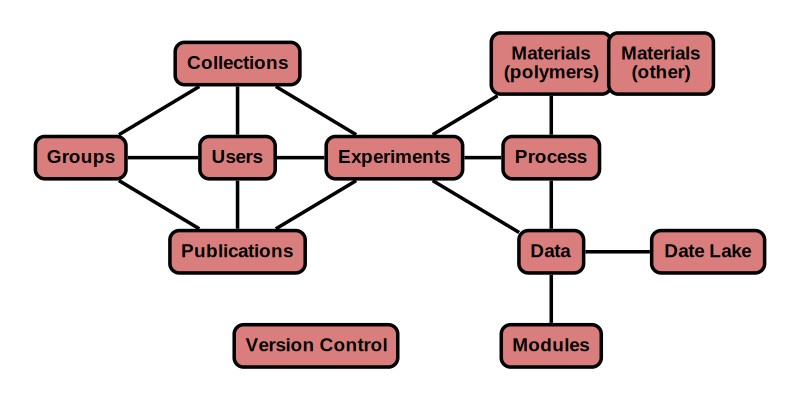

# Overview

As part of CRIPTS mission to develop an ecosystem for polymers, there was a need to generate a standard data schema 
to share polymer data. The following documentation details with the way in which polymer data is represented and 
stored and within the CRIPT ecosystem.

---

# Philosophy
### Reporting Guidelines
Reporting guidelines refers to what information is need to be captured about an experiment.

CRIPT has been designed with minimal reporting requirements as polymer data is highly variable in 
content and completeness. However, contributors of data are encouraged to provide as much data as possible as it ensures
the polymer data has sufficient information to contextualize the data. Additionally, the more information provided will 
aid in the discoverability of the data. More specific reporting guidance can be found in the following documents. 

### Vocabulary
Vocabulary (controlled) is the set of terminology that provides unique identification and definition of datum. 

CRIPT provide an expert curated vocabulary for polymer data. Contributors are highly encouraged to stick to the official 
vocabulary when possible, as it ensures data uniformity. Data uniformity is necessary for successful exchange information,
search, and data retrieval.

CRIPT recognizes that vocabulary may not cover all polymer data that contributors desire to add to the database, thus
CRIPT accepts any user-defined vocabulary such that it begins with a `+`. Contributors can petition for the addition of
new official vocabulary by emailing `cript@mit.edu` with the term, brief description, preferred units, and explanation
of why it should be added to the official vocabulary.

### Data exchange format
Data exchange format is the specification of how data is encoded to be a computer-readable and -processable format.

CRIPT structures data into to JSON files.

### Data structure
Data structure refers to the organization of data, and relationships into a schema.

CRIPT stores data into nodes. 

##### Version Control
Version control is a system that records changes to a file or data entry over time so that you can recall 
specific versions later.

The CRIPT database implements data version control as it provides a complete long-term change history of every file.
This benefits science by increasing data transparency and minimizes the re-analysis or processing of data.
Additionally, this allows for the locking of data in when submitting or publishing papers as the version of the data can be provided.

Another beneficial aspect of version control is the ability to branch and merge files. This enables multiple team 
members to work concurrently on the same experiment. Branching also facilitates multiple independent analysis on a data set
with different models and makes it easy to switch between them.

## Other file structure
* Overview
* JSON Schema
    * [BSON data types](https://docs.mongodb.com/manual/reference/bson-types/#timestamps)
* Description
* Example
    * Visualization of example

