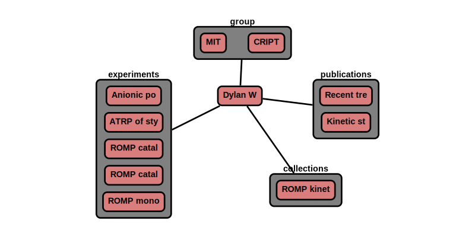

# User

The 'user' node contains data related to the user. Anyone who interacts with the database can be a user

**Features:**

* user can reference users, groups, publications
* required information
    * name
    * email
* optional information
    * notes
    * phone
    * website
    * twitter handle
    * ORCID #
    * organization
    * group (CRIPT node)
    * publications (CRIPT node)
    * experiments (CRIPT node)
    * collections (CRIPT node)
* auto generate/update:
    * _id
    * type
    * ver_sch
    * ver_con (& all child) <-- update with version control node
    * date (& all child)
    * users (& all child) <-- update with user node
    * group (& all child) <-- update with group node
    * pub (& all child) <-- update with publication node
    * expt (& all child) <-- update with experiment node
    * coll (& all child) <-- update with collection node


**App features to support this node:**

* a page to fill out: name, email, etc
* a tool to look up group, or enter _id
* a similar look up tool for experiments, collections, and publications
* allow additional optional information in attribute section given that it begins with +

## JSON Schema

```json
{
  "_id": objectId(),
  "type": "user",
  "ver_sch": string,
  "ver_con": {
    "_id": objectId(),
    "num": string
  },
  "date": [
    {"created": datetime},
    {"last_mod": datetime}
  ],
  "notes": string,
  "users": [
    {"_id": objectId(), "name": string, "perm": string}
  ],
  "name": string,
  "email": string,
  "attr": {
    "see attributes": "for details"
  }
}
```

---

## Description

Key             |Data Type     |Required  |Description
-------------   |---------     |------    |----
`_id`          |<span style="color:rgb(0, 72, 189)"> objectId() </span>|<span style="color:rgb(0, 72, 189)">  auto  </span>|<span style="color:rgb(0, 72, 189)">  unique database id  </span>
`type`          |<span style="color:rgb(0, 72, 189)">  string  </span> |<span style="color:rgb(0, 72, 189)">  auto  </span>|<span style="color:rgb(0, 72, 189)">  type of node ; Ex: "group"  </span>
`ver_sch`       |<span style="color:rgb(0, 72, 189)">  string  </span>|<span style="color:rgb(0, 72, 189)">  auto  </span>|<span style="color:rgb(0, 72, 189)">  schema version; Ex: "v0.1"  </span>
`ver_con`       |              |          |<span style="color:rgb(0, 72, 189)">  version control object  </span>
`ver_con/_id`   |<span style="color:rgb(0, 72, 189)">  objectId()  </span>|<span style="color:rgb(0, 72, 189)">  auto  </span>|<span style="color:rgb(0, 72, 189)">  reference id to node history  </span>
`ver_con/num`   |<span style="color:rgb(0, 72, 189)">  string  </span>|<span style="color:rgb(0, 72, 189)">auto  </span>|<span style="color:rgb(0, 72, 189)">  type of node ; Ex: "group"  </span>
`date`          |              |          |<span style="color:rgb(0, 72, 189)">  datetime object  </span>
`date/created`  |<span style="color:rgb(0, 72, 189)">  datetime  </span>|<span style="color:rgb(0, 72, 189)">auto  </span>|<span style="color:rgb(0, 72, 189)">  datetime created  </span>
`type/last_mod` |<span style="color:rgb(0, 72, 189)">  datetime  </span>|<span style="color:rgb(0, 72, 189)">auto  </span>|<span style="color:rgb(0, 72, 189)">  last modified datetime  </span>
`notes`         |<span style="color:rgb(0, 72, 189)">  string  </span>|<span style="color:rgb(0, 72, 189)">auto  </span> |<span style="color:rgb(0, 72, 189)">  free-form space to store any text  </span>
`users`               |     |      |<span style="color:rgb(12, 145, 3)">  user permissions </span>
`users/_id`           |<span style="color:rgb(12, 145, 3)">  objectId()   </span>|<span style="color:rgb(12, 145, 3)">  auto   </span>|<span style="color:rgb(12, 145, 3)">  user id  </span>
`users/name`          |<span style="color:rgb(12, 145, 3)">  string  </span>|<span style="color:rgb(12, 145, 3)">  auto   </span>|<span style="color:rgb(12, 145, 3)">  user name  </span>
`users/perm`          |<span style="color:rgb(12, 145, 3)">  string  </span>|<span style="color:rgb(12, 145, 3)">  auto   </span>|<span style="color:rgb(12, 145, 3)">  permission level; [r: read, w: write, a: append]  </span>
`name`                | string        | required      | name of user
`email`               | string        | required      | user email address
`attr`                | dict          |               | see attributes section
*username  |
*password  |

### Attributes

Attributes are optional properties that can be associated with this node. The following list is the officially supported
keys. Users may define their own keys by placing a '+' in front of their custom key.

Key                   | Data Type      | Description
-------------         |---------       |----
`phone`               | string         | phone number (###-###-####)
`web`                 | string         | website
`twitter`             | string         | twitter handle
`orcid`               | string         | [ORCID number](https://orcid.org/)
`organization`        | string         | author's organization
`position`            | string         | author's position in organization
`group`               |                | [groups that the user belongs to](../data-models/Groups.md)
`group\_id`           | objectId()     | id of group
`group\name`          | string         | name of group
`pub`                 |                | [publications the user authored](../data-models/Publications.md)
`pub\_id`             | objectId()     | id of publication
`pub\title`           | string         | title of publication
`expt`                |                | [experiment nodes](../data-models/Experiments.md)
`expt\_id`            | objectId()     | id of experiment
`expt\name`           | string         | name of experiment
`expt\date`           | datetime       | date of experiment
`coll`                |                | [collection nodes](../data-models/Collections.md)
`coll\_id`            | objectId()     | id of collection
`coll\name`           | string         | name of collection
`coll\date`           | datetime       | date of collection
`coll\date\num_expt`  | double         | number of experiments in collection

---

## Example

```json
{
  "_id": "507f191e810c19729de860ec",
  "type": "user",
  "ver_sch": "v0.1",
  "ver_con": {
    "_id": "507f191e810c19729de860cb",
    "num": "v0.1"
  },
  "date": [
    {"created": 1612889183},
    {"last_mod": 1612889123}
  ],
  "notes": "",
  "users": [
    {"_id": "507f191e810c19729de860ec", "name": "Dylan W", "perm": "w"}
  ],
  "name": "Dylan W",
  "email": "dylan@cript.edu",
  "attr": {
    "phone": "123-456-7890",
    "orcid": "0000-0000-0000-0001",
    "organization": "MIT",
    "position": "Research Assistant",
    "group": [
      {"_id": "507f191e810c19729de860em", "name": "MIT"},
      {"_id": "507f191e810c19729de860en", "name": "CRIPT"}
    ],
    "pub": [
      {"_id": "507f191e810c19729de860eq", "name": "Recent trends in catalytic polymerizations"},
      {
        "_id": "507f191e810c19729de860er",
        "name": "Kinetic study of living ring-opening metathesis polymerization with third-generation Grubbs catalysts"
      }
    ],
    "expt": [
      {"_id": "507f191e810c19729de860em", "name": "Anionic polymerization", "date": 1612886423},
      {"_id": "507f191e810c19729de860en", "name": "ATRP of styrene with CuCl", "date": 1612886423},
      {"_id": "507f191e810c19729de860ej", "name": "ROMP catalyst kinetics low conc", "date": 1612886423},
      {"_id": "507f191e810c19729de860er", "name": "ROMP catalyst kinetics high conc", "date": 1612886426},
      {"_id": "507f191e810c19729de860er", "name": "ROMP monomer kinetics", "date": 1612886426}
    ]
  },
  "coll": [
    {"_id": "507f191e810c19729de860em", "name": "ROMP kinetic study", "date": 1612886423, "num_expt": 3}
  ]
}
```

### Visualization

